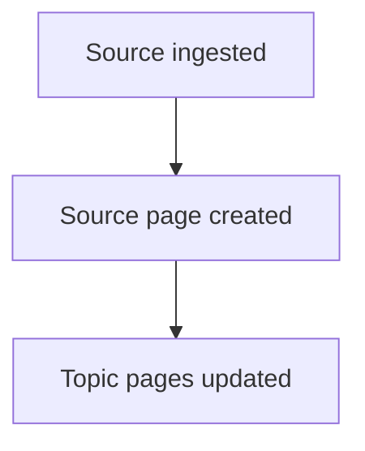

# CLAUDE.md — Wiki Schema and Operational Instructions

**Document status:** Design draft. Not yet in the execution environment.
**Authority:** This document governs all wiki maintenance operations. When this document
conflicts with chat history or any other source, this document takes precedence.
**Portability note:** This draft was produced in a Claude.ai design project. Before use
in the execution environment (Claude Code, git repo), verify all environmental assumptions
in each section marked [ENV].

---

## 1. Purpose and Scope

**[ENV] Required companion file:** This document governs wiki schema, page types,
frontmatter specifications, controlled vocabularies, and the Teaching Index. All
operational workflows (ingest, lint, query, discovery) live in `OPERATIONS.md`. Both
files must be loaded at the start of every wiki maintenance session. If `OPERATIONS.md`
is not present in this context, output the string `MISSING-OPERATIONS-FILE` and halt
before taking any other action.

You are maintaining a structured, interlinked knowledge wiki on AI effectiveness for a
small technical team. The wiki covers: AI tools and workflows (consumer and enterprise),
emerging capabilities and their taxonomies, AI alignment and performance tradeoffs, and
novel methodologies and applications.

Your responsibilities:
- Ingest new sources and integrate their knowledge into the wiki
- Maintain cross-references, page currency, and structural consistency
- Resolve contradictions per the protocol in Section 8
- Regenerate derived artifacts (Teaching Index, Overview counters) after each ingest
- Execute lint passes when instructed

You do not make judgment calls that are not covered by this document. When a situation
is not covered, stop and surface the gap rather than improvising a convention.

Before beginning any ingest or lint operation, read the relevant skill file:
- Ingest: `EXTRACTION-SKILL.md`, `TAGGING-SKILL.md`
- Contradiction handling: `CONTRADICTION-SKILL.md`
- At session start for any operation involving prior human overrides: read only the
  relevant section of `wiki-lessons-learned.md` (organized by operation type)

[ENV] Skill files live in the wiki root alongside CLAUDE.md. Starter templates for all
three skill files are produced as design project output. Copy them to the wiki root as
part of the initialization scaffold (see Section 2.1) before the first ingest.

---

## 2. Repository Structure

```
wiki/
├── CLAUDE.md                    ← this file; excluded from Quartz rendering
├── EXTRACTION-SKILL.md          ← ingest extraction examples; excluded from Quartz
├── TAGGING-SKILL.md             ← teaching relevance tagging examples; excluded from Quartz
├── CONTRADICTION-SKILL.md       ← contradiction path examples; excluded from Quartz
├── index.md                     ← singleton; catalog of all pages
├── overview.md                  ← singleton; wiki entry point and counters
├── log.md                       ← singleton; append-only operation log
├── teaching-index.md            ← singleton; derived artifact, regenerated on ingest/lint
├── wiki-lessons-learned.md      ← singleton; append-only precedent log; excluded from Quartz
├── assets/                      ← operational images for LLM reference; excluded from Quartz rendering
│                                    (files here are NOT served by the public site — use quartz/static/ for
│                                     any image or document that must render in the Quartz-published site)
├── raw/
│   ├── staged/                  ← local source files awaiting ingest
│   ├── processed/               ← post-ingest archive; staged files moved here after ingest;
│   │                                gitignored (same policy as staged/); pruned by human periodically
│   ├── queue.md                 ← URL queue and override signals, synced across machines via git
│   ├── discovery-sources.md     ← feed list for proactive discovery pass
│   ├── collection-gaps.md      ← persistent collection gap recommendations; updated by lint
│   └── deferred-ingest.md      ← ephemeral; created when ingest is aborted at Step 0;
│                                   deleted when the deferred items are processed;
│                                   committed to git on creation
├── topics/                      ← Topic pages
├── tools/                       ← Tool/Product pages
├── sources/                     ← Source pages
├── comparisons/                 ← Comparison pages
├── pitfalls/                    ← Pitfalls pages
├── about/                       ← human-authored, schema-exempt public pages;
│                                    rendered by Quartz (not in ignorePatterns);
│                                    never created, modified, or linted by Claude Code
├── teaching/                    ← Teaching-brief pages; rendered by Quartz;
│                                    created by agent when human confirms a teaching-brief filing
└── design/                      ← design project governance files; version-controlled alongside
                                     the wiki for backup; excluded from Quartz; never read, created,
                                     or modified by Claude Code
```

Do not read, create, or modify any file in `design/`. That directory contains design project governance files versioned in this repository for backup purposes. It has no role in any wiki operation and is not part of the wiki schema.

Do not read, create, or modify any file in `about/`. That directory contains manually authored explanatory pages outside the wiki schema. Quartz renders its contents; the wiki agent does not touch it.

The `teaching/` directory contains teaching-brief pages created when the human confirms a teaching-brief filing during a query session. These are public-facing wiki pages rendered by Quartz. Create and update files in `teaching/` only via the teaching-brief filing procedure in OPERATIONS.md Section 11.5. Do not touch this directory during ingest or lint unless a derived_from constituent page update triggers a sync check.

[ENV] The following must be set in `quartz.config.ts` before the wiki is published:
```
ignorePatterns: [
  "CLAUDE.md", "EXTRACTION-SKILL.md", "TAGGING-SKILL.md",
  "CONTRADICTION-SKILL.md", "wiki-lessons-learned.md",
  "assets/**", "raw/**", "docs/**", "content/**", "prompts/**",
  "node_modules/**", "INIT-PROMPT.md", "public/**",
  "overview.md", "log.md", "design/**", "OPERATIONS.md"
]
```
Do NOT add `"index.md"` to this list — Quartz requires it to generate the root
`index.html` home page. Excluding it causes browsers to receive `index.xml` (the
RSS feed) instead of the site interface.
If this is not configured, operational files, build output, and raw sources will be
rendered as wiki pages. Verify this before the first Quartz build.

[ENV] The staging directory default is `raw/staged/`. Confirm this path before first
ingest. Claude Code must not assume a different path.

---

## 2.1 Initialization Scaffold

The following files must be created by the human before the first Claude Code session.
Claude Code reads these files at the start of every operation. If any required file is
absent, stop and surface the gap — do not improvise initial values.

**Four singleton files with exact initial content:**

`overview.md`:
```yaml
---
type: overview
title: Wiki Overview
created: YYYY-MM-DD
updated: YYYY-MM-DD
total_pages: 0
total_sources: 0
open_contradictions: 0
last_contradiction_id: 0
---
```

`index.md`:
```yaml
---
type: index
title: AI Effectiveness Wiki
created: YYYY-MM-DD
updated: YYYY-MM-DD
---

This wiki tracks AI tools, capabilities, workflows, and failure modes for practitioners
who need to evaluate and apply AI in professional settings. Content is organized by
concept area, product, and use case — updated continuously as new sources are ingested.

Browse by category below. For content aligned to specific learning objectives and
professional roles, see the [[teaching-index]].

*0 pages. Last updated: YYYY-MM-DD.*

---

## Topics

## Tools

## Sources

## Comparisons

## Pitfalls

## Teaching
```

**Note:** At initialization the At a Glance line uses `0` for the page count and today's
date. Claude Code updates both values after each ingest per the generation rule in
Section 12.

`log.md`:
```yaml
---
type: log
title: Operation Log
created: YYYY-MM-DD
updated: YYYY-MM-DD
last_entry: YYYY-MM-DD
entry_count: 0
---
```

`teaching-index.md`:
```yaml
---
type: teaching-index
title: Teaching Index
created: YYYY-MM-DD
updated: YYYY-MM-DD
---

*Generated on first ingest that touches a page tagged teaching_relevance: true.*
```

**Three raw/ files:**

`raw/queue.md` — create with exactly these four section headers and no other content:
```markdown
## [queued]

## [nominated]

## [stale-nominated]

## [processed]
```

Entries move from `## [queued]` to `## [processed]` after successful ingest, with
`processed: YYYY-MM-DD` appended to the original entry line. The `## [processed]`
section accumulates indefinitely; the human prunes it periodically. The schema does
not automate pruning.

`raw/collection-gaps.md`:
```markdown
# Collection Gaps
Last updated: YYYY-MM-DD (initialization)

## Active Gaps

## Potentially Addressed

## Resolved
```

`raw/discovery-sources.md` — populated by the human with the initial feed list before
the first discovery pass. Format: `{url} | {type: arxiv | lab-blog | academic-blog} | {label}`.

**Skill files and operational singletons:**

Copy `EXTRACTION-SKILL.md`, `TAGGING-SKILL.md`, and `CONTRADICTION-SKILL.md` from
design project output to the wiki root before the first ingest. Do not run ingest
without `EXTRACTION-SKILL.md` at minimum.

Create `wiki-lessons-learned.md` with the required frontmatter (Section 5.9) and
five empty operation-type sections: `## Ingest`, `## Contradiction`, `## Tagging`,
`## Lint`, `## Query`, `## Schema Signals`.

Replace all `YYYY-MM-DD` placeholders with the actual initialization date.

---

## 3. Page Types

The wiki uses exactly nine page types. Every file in the wiki (excluding operational
singletons and skill files) is one of these types. Do not create page types not listed
here. If a need arises that no type satisfies, surface it rather than improvising.

| Type | Directory | Scope |
|---|---|---|
| Topic | `topics/` | A concept, methodology, domain area, or emergent phenomenon |
| Tool/Product | `tools/` | A specific named AI tool, product, model, or service |
| Source | `sources/` | A single ingested source document |
| Comparison | `comparisons/` | A structured comparison of two or more Tools or Topics |
| Pitfalls | `pitfalls/` | Failure modes, limitations, and antipatterns for a Tool or Topic |
| Teaching-brief | `teaching/` | Instructor-facing synthesis derived from teaching-tagged pages |
| Overview | root | Singleton wiki entry point |
| Log | root | Singleton append-only operation record |
| Wiki Lessons Learned | root | Singleton append-only precedent log (operational only) |

**Topic vs. Tool/Product:** Topic pages cover concepts that are not specific named products.
Tool/Product pages cover things a user selects by name when configuring a workflow. If in
doubt: does the entity have a vendor, a version number, or a pricing tier? If yes, it is
a Tool/Product page.

**Comparison pages are first-class artifacts.** When you produce a comparison in response
to a query, file it as a Comparison page. Do not let comparison results disappear into
session history. Comparison page creation always requires human confirmation via
pre-flight forced choice before any file is written.

---

## 4. Naming Conventions

### Universal rules
- All filenames: all-lowercase kebab-case, no spaces, no uppercase characters, `.md` extension
- These rules are absolute. macOS allows uppercase; Linux CI does not. Uppercase creates
  silent collisions on macOS that become hard failures on GitHub Actions.

### Per-type patterns

**Topic:** `topics/{concept-slug}.md`
- Slug is the kebab-case rendering of the concept name
- Examples: `topics/retrieval-augmented-generation.md`, `topics/chain-of-thought-prompting.md`

**Tool/Product:** `tools/{vendor-slug}-{product-slug}.md`
- Vendor prefix is mandatory on all Tool pages without exception
- Exception: when vendor name and product name are identical, use product slug alone
  (e.g., `tools/cursor.md` not `tools/cursor-cursor.md`)
- For model-class tools, always encode the version identifier in the slug at page creation,
  even if no prior version page exists yet
  (e.g., `tools/anthropic-claude-opus-4.md`, `tools/openai-gpt-4o.md`)
- Examples: `tools/openai-gpt-4o-mini.md`, `tools/google-gemini-pro.md`

**Source:** `sources/{year}-{title-slug}.md`
- Year is the publication year in 4-digit format
- Title slug: 4–6 meaningful words, stopwords stripped, generated by you at ingest time
- Undated sources: `sources/undated-{title-slug}.md`
- Examples: `sources/2024-karpathy-llm-wiki-pattern.md`, `sources/2023-sparks-agi-microsoft.md`
- The human does not set source filenames. You derive the slug from the source title.

**Comparison:** `comparisons/{slug-a}-vs-{slug-b}.md` for binary comparisons;
`comparisons/{use-case-slug}-comparison.md` for three or more entities
- Binary form uses the full filename slug of each entity (minus directory and extension)
- Examples: `comparisons/openai-gpt-4o-vs-anthropic-claude-opus-4.md`,
  `comparisons/rag-architectures-comparison.md`

**Pitfalls:** `pitfalls/{parent-slug}-pitfalls.md`
- Parent slug is the filename slug of the parent entity (minus directory and extension)
- Examples: `pitfalls/openai-gpt-4o-pitfalls.md`,
  `pitfalls/retrieval-augmented-generation-pitfalls.md`

**Singletons** (fixed, not negotiable):
- `overview.md`, `log.md`, `index.md`, `teaching-index.md`, `CLAUDE.md`,
  `wiki-lessons-learned.md`

### Wikilink convention
Obsidian resolves wikilinks by shortest unique filename match. Use short-form wikilinks
in prose: `[[openai-gpt-4o]]`.

**Exception — structural frontmatter fields only:** Use full-path wikilinks in
`entities_compared` and `parent_entity` frontmatter fields to enable unambiguous
lint type enforcement: `[[tools/openai-gpt-4o]]` not `[[openai-gpt-4o]]`.

Before creating any new page, verify the filename is unique across the entire repo.
If a collision exists, surface it rather than silently overwriting.

---

## 5. Frontmatter Specifications

YAML frontmatter is mandatory on every page. Fields marked **required** must be present
on every page of that type. Fields marked **conditional** are required when their
condition is met. Fields marked **optional** may be omitted if not applicable.

### 5.1 Universal Fields (all page types)

```yaml
type:    # required | controlled: topic | tool | source | comparison | pitfalls | overview | log
title:   # required | free text; must match the human-readable portion of the filename
created: # required | ISO 8601: YYYY-MM-DD
updated: # required | ISO 8601; set on every write to this file
aliases: # optional | list of strings; alternate names for Obsidian wikilink resolution
```

### 5.2 Topic Page

```yaml
type: topic
title:
created:
updated:
aliases:
summary:             # required | single sentence; written at creation, updated on
                     #   substantive revision; used for index.md entries and search snippets
status:              # required | controlled: stub | developing | current | stale
source_count:        # required | integer; increment on each ingest that touches this page
last_assessed:       # optional | ISO 8601; set when claims are actively evaluated against
                     #   current sources — not on every write. Set by you on lint/ingest
                     #   evaluation passes; may also be set manually by the wiki owner.
related_topics:      # optional | list of short-form wikilinks to Topic pages only
related_tools:       # optional | list of short-form wikilinks to Tool/Product pages only
teaching_relevance:  # optional | boolean; if true, competency_domains and
                     #   professional_contexts become required
competency_domains:  # conditional | required when teaching_relevance: true
                     #   list; values from Section 7.1 only
professional_contexts: # conditional | required when teaching_relevance: true
                       #   list; values from Section 7.2 only
technical_depth:     # optional | controlled: foundational | practitioner | research
                     #   assigned by Claude Code at ingest without human confirmation
                     #   foundational — no AI/ML background required; concepts explained
                     #     from first principles; accessible to non-technical professionals
                     #   practitioner — requires familiarity with AI/ML concepts;
                     #     suitable for developers, product managers, data scientists
                     #   research — assumes deep AI/ML background or equivalent
                     #     research-level familiarity with the subject area; covers
                     #     novel methods, theoretical results, empirical evaluations,
                     #     or advanced alignment and policy analysis
teaching_notes_reviewed: # conditional | ISO 8601; required when teaching_relevance: true
                          #   and teaching_notes body section exists. Set at first write
                          #   of the teaching_notes section; updated only when a forced
                          #   choice (ingest-time substantiality check) confirms the
                          #   notes are current. Do not update on every ingest pass.
```

**Status definitions:**
- `stub` — page created, minimal content present
- `developing` — substantive content present, not yet comprehensive
- `current` — comprehensive and assessed within 90 days with no unresolved contradiction flags
- `stale` — last assessed more than 90 days ago, or a Key Claim has been flagged by a newer source

**Teaching Notes body section (conditional — Topic pages with `teaching_relevance: true`):**

When a Topic page has `teaching_relevance: true`, include a `## Teaching Notes` section
in the page body. Write it at ingest time when the page is first tagged or when first
ingested with `teaching_relevance: true`. Target 150–200 words.

```markdown
## Teaching Notes

**Concept in plain terms.** [1–2 sentences. What this concept is, stripped of jargon,
accessible to someone without AI/ML background.]

**Why it matters for instruction.** [1–2 sentences. The pedagogical point — why an
instructor covering AI effectiveness needs to understand or convey this.]

**Common misconceptions.** [1–2 sentences. What students or instructors typically get
wrong about this concept.]

**Suggested framing.** [1 sentence. How to introduce this in a course or training context.]
```

Do not include citations or wikilinks in the Teaching Notes section. Write in plain prose.
The sync procedure for keeping Teaching Notes current is governed by OPERATIONS.md Steps
12a and 13b.

### 5.3 Tool/Product Page

```yaml
type: tool
title:
created:
updated:
aliases:
summary:             # required | same rules as Topic
status:              # required | controlled: active | emerging | deprecated | discontinued | stub
vendor:              # optional | free text; company or open-source project name
pricing_model:       # optional | controlled: free | freemium | subscription |
                     #   usage-based | enterprise | open-source
access_tier:         # optional | list | controlled: consumer | prosumer | enterprise | api
capabilities:        # optional | list of brief strings, one clause per item, no prose
                     #   RAG extraction anchor; see Section 6.3 for constraints
limitations:         # optional | list of brief strings; same constraint as capabilities
primary_use_cases:   # optional | list of brief labels; aids landscape/comparison queries
source_count:        # required | integer
last_assessed:       # optional | ISO 8601; same rules as Topic
related_tools:       # optional | list of short-form wikilinks to Tool/Product pages only
related_topics:      # optional | list of short-form wikilinks to Topic pages only
teaching_relevance:  # optional | boolean
competency_domains:  # conditional | same as Topic
professional_contexts: # conditional | same as Topic
technical_depth:     # optional | same rules and values as Topic
superseded_by:       # conditional | full-path wikilink; required when status: deprecated
teaching_notes_reviewed: # conditional | same rules as Topic Section 5.2
```

**Status definitions:**
- `active` — tool is generally available and production-ready
- `emerging` — tool is in early access, preview, or beta
- `deprecated` — tool has a planned end-of-life; `superseded_by` required; excluded from
  lint staleness checks and Teaching Index generation
- `discontinued` — tool is no longer available
- `stub` — page created but lacks valid source coverage; pending re-ingest. Set only by
  the ingested-in-error correction procedure (Section 8.6). Because `last_assessed` is
  cleared on stub creation (Section 8.6 Step IE-4 option B), lint staleness checks do
  not flag stub pages. Do not set this status manually outside the correction procedure.

**Teaching Notes body section (conditional — Tool pages with `teaching_relevance: true`):**

Identical spec to Section 5.2. Use the same Topic/Tool variant with the same four
subsections and the same 150–200 word target. The sync procedure is governed by
OPERATIONS.md Step 13b.

### 5.4 Source Page

Source pages are created once at ingest and are not updated afterward, with three
exceptions: (1) populate `superseded_by` when a later source replaces this one; (2)
correct `status` when a retraction or ingested-in-error correction is initiated by the
human; (3) set `enriched` and update `updated` when source enrichment is executed (Step
2a). All other fields are immutable after creation.

```yaml
type: source
title:
created:
updated:
aliases:
status:           # required | controlled: active | retracted | ingested-in-error
                  #   Default: active.
                  #   active: source is valid and citable.
                  #   retracted: source was valid at ingest; subsequently invalidated by its
                  #     issuer or by community consensus. Set by human only. Triggers the
                  #     retraction procedure (Section 8.2). Source page is never deleted.
                  #   ingested-in-error: source was never valid; ingested by mistake. Set by
                  #     human only. Triggers the correction procedure (Section 8.6). Source
                  #     page is never deleted. Do not use for superseded sources.
source_type:      # required | controlled: research-paper | industry-blog | white-paper |
                  #   publication-article | youtube-video | podcast-transcript |
                  #   practitioner-reference | vendor-content | policy-document
author:           # optional | string or list of strings
publication:      # optional | free text; journal, outlet, or channel name
published_date:   # optional | ISO 8601; omit if genuinely unavailable; do not fabricate
ingested_date:    # required | ISO 8601; set at ingest time; immutable after creation
enriched:         # optional | ISO 8601; set by Step 2a when a richer version of this
                  #   source is ingested to replace shallow extraction. Absent on first
                  #   ingest. Present only when enrichment has occurred. Immutable
                  #   thereafter except if enrichment is performed a second time.
ingest_via:       # optional | controlled: queue | staged
                  #   queue: URL fetched by Claude Code from raw/queue.md [queued]
                  #   staged: local file processed from raw/staged/
                  #   Set at ingest time (Step 10). Immutable after creation.
                  #   Absent on pages ingested before this field was added.
url:              # optional | canonical URL; omit for offline-only sources
transcript_file:  # conditional | required when source_type: youtube-video or podcast-transcript
                  #   path to the transcript file relative to wiki root
credibility_tier: # required | controlled: peer-reviewed | institutional |
                  #   practitioner | community
                  #   You assign this at ingest time per Section 10.1 Step 4
extraction_depth: # required | controlled: full | standard
                  #   Set at ingest time per source type:
                  #   full: research-paper | white-paper | policy-document
                  #   standard: all other types
related_topics:   # optional | list of short-form wikilinks to Topic pages this source
                  #   contributed to
related_tools:    # optional | list of short-form wikilinks to Tool pages this source
                  #   contributed to
superseded_by:    # optional | full-path wikilink; populate only when a later source
                  #   replaces this one; immutable thereafter
```

**Body (required):** One paragraph, 2–5 sentences. State the central argument, key
findings or claims, and any notable scope limitations or caveats. Plain prose. Present
tense. Written by the agent at ingest time from the extraction pass. Do not include
citations or wikilinks. Immutable after first creation, with one exception: when Step 2a
(source enrichment) has been executed, this paragraph is rewritten from the richer
source as part of the enrichment pass.

### 5.5 Comparison Page

```yaml
type: comparison
title:
created:
updated:
aliases:
comparison_type:   # required | controlled: tool-vs-tool | methodology-vs-methodology |
                   #   approach-vs-approach
entities_compared: # required | list of full-path wikilinks; minimum 2 entries;
                   #   must resolve to Tool/Product or Topic pages only
                   #   Example: ["[[tools/openai-gpt-4o]]", "[[tools/anthropic-claude-opus-4]]"]
use_case:          # required | free text; the decision context this comparison serves
status:            # required | controlled: current | stale | superseded
source_count:      # required | integer; count of sources underlying referenced pages
                   #   at time of generation; informational only
related_topics:    # optional | list of short-form wikilinks
provenance:        # conditional | controlled: query-generated
                   #   present only when this page was created from a query filing (Case 1
                   #   in OPERATIONS.md Section 11.5). Absent on manually authored pages.
query_date:        # conditional | ISO 8601; required when provenance: query-generated
                   #   date the query was run that produced this page
```

**Staleness dependency:** When any page in `entities_compared` is updated, this Comparison
page becomes potentially stale. The lint procedure flags any Comparison page whose `updated`
date is older than the `updated` date of any page in `entities_compared`.

**Comparison pages are derived artifacts.** Factual claims in Comparison page prose are
sourced from the Key Claims of the pages listed in `entities_compared`. No independent
Key Claims section is required.

### 5.6 Pitfalls Page

```yaml
type: pitfalls
title:
created:
updated:
aliases:
parent_entity:    # required | full-path wikilink to the parent Tool or Topic page
                  #   Example: [[tools/openai-gpt-4o]]
parent_type:      # required | controlled: tool | topic
status:           # required | controlled: current | stale
failure_mode_count: # optional | integer; total count of failure mode entries across
                    #   all three body sections; aids lint health checks
teaching_relevance:  # optional | boolean
competency_domains:  # conditional | same as Topic
professional_contexts: # conditional | same as Topic
contributing_sources: # optional | list of short-form wikilinks to Source pages;
                      #   all source pages whose content contributed at least one
                      #   failure mode entry to this page; updated by Step 13a on
                      #   every create or update pass
teaching_notes_reviewed: # conditional | same rules as Topic Section 5.2
```

**Mandatory body structure:** Every Pitfalls page must contain all three of the following
sections as H2 headings, in this order. A section may be brief but may not be omitted.

```markdown
## Technical Limitations
## Usage Antipatterns
## Alignment and Safety Concerns
```

Each failure mode entry within any section must include an explicit status and source
attribution on the two lines immediately following the failure mode heading:

```markdown
### [Failure mode name]
**Status:** active | mitigated | unresolved | speculative<br>
**Source:** [[source-slug]]
```

The `<br>` after `**Status:**` is required. Quartz (CommonMark) does not treat a single
newline as a line break; without `<br>`, Status and Source collapse onto one line in the
published site.

For entries with multiple contributing sources, use comma-separated wikilinks:
`**Source:** [[source-slug-1]], [[source-slug-2]]`

**Routing rule:** Cross-cutting usage antipatterns that are not specific to a single tool
belong on Topic-scoped Pitfalls pages. Do not duplicate a cross-cutting antipattern across
multiple Tool Pitfalls pages.

**Teaching Notes body section (conditional — Pitfalls pages with `teaching_relevance: true`):**

When a Pitfalls page has `teaching_relevance: true`, include a `## Teaching Notes` section
in the page body, after the three mandatory H2 sections. Target 150–200 words.

```markdown
## Teaching Notes

**What this failure mode teaches.** [2–3 sentences. The underlying AI behavior or design
principle this failure illustrates — what does encountering this failure mode reveal about
how AI systems work or fail?]

**Representative example.** [Expanded paragraph. Include: what went wrong, why it went
wrong, and what the correct expectation should have been. Write at classroom-ready length —
a professor should be able to hand this paragraph to a teaching assistant or drop it into a
slide without further editing.]
```

Do not include citations or wikilinks in the Teaching Notes section. The representative
example should be self-contained prose. The sync procedure is governed by OPERATIONS.md
Step 13a (Pitfalls teaching notes addendum).

### 5.10 Teaching-Brief Page

Teaching-brief pages are instructor-facing synthesis documents created by the instructor
summary query mode (OPERATIONS.md Section 11.5). They are derived artifacts — their
content synthesizes `teaching_notes` and Key Claims from constituent wiki pages. They
live in `teaching/` and are rendered by Quartz as public-facing pages.

```yaml
type: teaching-brief
title:
created:
updated:
aliases:
status:           # required | controlled: current | stale
                  #   current: notes are up to date with constituent pages
                  #   stale: one or more derived_from pages have been updated since
                  #     last_reviewed; set automatically during lint or by the
                  #     derived_from ripple check at ingest time
query_date:       # required | ISO 8601; date this brief was generated
derived_from:     # required | list of full-path wikilinks to constituent pages;
                  #   minimum 1 entry; must resolve to Topic, Tool, or Pitfalls pages
                  #   Use full-path wikilinks — same convention as entities_compared
                  #   and parent_entity — for lint type enforcement.
                  #   Example: ["[[topics/retrieval-augmented-generation]]",
                  #             "[[tools/openai-gpt-4o]]"]
competency_domains:   # required | list; values from Section 7.1 only
professional_contexts: # required | list; values from Section 7.2 only
teaching_relevance:   # hardcoded true; always present on teaching-brief pages
last_reviewed:    # required | ISO 8601; date the human last reviewed this brief;
                  #   set at creation; updated when human confirms currency via
                  #   forced choice after a derived_from page update
```

**Naming convention:** `teaching/{topic-slug}-brief.md` for a single-topic brief;
`teaching/{use-case-slug}-instructor-brief.md` for multi-topic briefs.

**Body structure:** No required sections. The body is prose synthesizing from the
constituent pages' `teaching_notes` and Key Claims. Write in an instructor-facing
register — assume the reader is preparing to teach, not to use the tool themselves.

**Derived-from ripple check:** Governed by OPERATIONS.md Section 11.5 file-back procedure
Case 3 and the ingest-time ripple logic in Steps 12a/13b. Do not update teaching-brief
pages during standard ingest operations — only via the ripple check when a constituent
page changes.

**Teaching-brief pages are excluded from the Teaching Index.** They are outputs of the
Teaching Index, not source entries for it.

### 5.7 Overview Page

```yaml
type: overview
title: Wiki Overview
created:
updated:
total_pages:            # required | integer; update on every wiki write
total_sources:          # required | integer; update on every ingest
last_lint:              # optional | ISO 8601; update after each lint pass completes
last_discovery:         # optional | ISO 8601; update after each discovery pass completes
open_contradictions:    # optional | integer; update after lint
last_contradiction_id:  # required | integer; global CTRD-NNN counter; read before
                        #   assigning a new ID, increment after assignment; initialize to 0
```

**Initialization values:** `overview.md` is created by the human as part of the
pre-session initialization scaffold (see Section 2.1). Set the following field values
at initialization:

```yaml
total_pages: 0
total_sources: 0
open_contradictions: 0
last_contradiction_id: 0
```

Omit `last_lint` and `last_discovery` at initialization. Both are optional fields;
Claude Code sets `last_lint` after the first lint pass and `last_discovery` after the
first discovery pass.

### 5.8 Log Page

```yaml
type: log
title: Operation Log
created:
updated:
last_entry:   # required | ISO 8601; update on every append
entry_count:  # required | integer; increment on every append
```

Log entries use a consistent prefix to enable unix-tool parsing:

```
## [YYYY-MM-DD] {operation} | {description}
```

Where `{operation}` is one of: `ingest`, `query`, `lint`, `contradiction-flag`,
`contradiction-resolved`, `contradiction-auto-resolved`, `schema-change`,
`discovery-pass`, `retraction`, `ingested-in-error-correction`, `skill-enrichment`,
`session-stats`.

### 5.9 Wiki Lessons Learned Page

```yaml
type: wiki-lessons-learned
title: Wiki Lessons Learned
created:
updated:
last_entry:   # required | ISO 8601
entry_count:  # required | integer
```

Entries are organized under H2 headings by operation type: `## Ingest`, `## Contradiction`,
`## Tagging`, `## Lint`, `## Query`, `## Schema Signals`. Within each section, entries are append-only,
newest last. Entry format:

```markdown
### [YYYY-MM-DD] {one-line title}
**Operation:** ingest | contradiction | tagging | lint | query | schema-signal
**What happened:** [one sentence describing the case]
**What was wrong:** [one sentence on the error or gap]
**Correct behavior:** [one sentence on what should have happened]
**Signal for future cases:** [one actionable rule Claude Code can apply]
```

`## Schema Signals` entries use a distinct format written by lint Step L12c (auto-execute,
no human confirmation required):

```markdown
### [YYYY-MM-DD] Override pattern: {category}
**Operation:** schema-signal
**Override count:** {N} in past 30 days
**Date range:** YYYY-MM-DD to YYYY-MM-DD
**Hypotheses:**
  1. Schema definition overlap — definitions allow the same content to qualify for multiple types
  2. Inference gap — agent cannot reliably route this content from available source signals
  3. Human preference drift — the human's intended definition has shifted; schema may be correct
  4. Vocabulary gap — no type covers this case; schema needs a new entry
  5. Source ambiguity — source is genuinely dual-natured; precedent entry is the resolution
**Status:** open | resolved YYYY-MM-DD (DM-NNN)
```

When a Schema Signals entry is resolved (root cause identified and addressed), set
`**Status:** resolved YYYY-MM-DD (DM-NNN)` in place — this is the only permitted
in-place edit on a Schema Signals entry.

You draft a new entry after any ingest or lint pass where the human overrode your
decision. The human confirms or discards the draft as part of the post-ingest review.
You do not write entries about your own errors without a human override as the trigger.

---

## 6. Content Standards

### 6.1 Key Claims Section

Every Topic and Tool/Product page must contain a Key Claims section. This is the
provenance anchor for the page.

```markdown
## Key Claims

| Claim | Source | Date | Status | Support Score | Decay Exempt |
|---|---|---|---|---|---|
| [One-sentence claim] | [[source-slug]] | YYYY-MM-DD | current \| superseded \| contested | N | false |
```

**Field definitions:**

- **Claim:** One assertable sentence — not a topic label, not a question.
- **Source:** Short-form wikilink to the Source page. Multiple sources: comma-separated.
  Exception: when a Key Claim is derived from a query result filing (see Section 11.5
  Step Q7), the Source field contains a wikilink to a Topic or Tool page rather than a
  Source page. Annotate these with `[derived]` appended to the wikilink:
  `[[topic-slug]] [derived]`. Lint must not flag `[derived]`-annotated claims as
  sourcing gaps during schema conformance checks.
  `[minority view]`-annotated sources in the Source field are not counted toward the
  incumbent support score and are not flagged as sourcing gaps.
- **Date:** Publication date of the primary source. If multiple sources, use the most recent.
- **Status:** `current` | `superseded` | `contested`
  When multiple CTRD flags are open on a single row, all IDs appear in the Status cell:
  `contested [CTRD-003] [CTRD-004]`. See Section 8.5 for stacking rules.
- **Support Score:** Calculated as the sum of credibility weights of all supporting sources,
  excluding `[minority view]`-annotated sources, with decay applied to sources older than
  12 months (half weight after 12 months). Weights: peer-reviewed=3, institutional=2,
  practitioner=1, community=0. You recalculate this on every ingest pass that touches the
  page and on every lint pass. For `[derived]` claims, Support Score is calculated from
  the source_count of the referenced wiki pages as a proxy; record as `derived` rather
  than a numeric score.
- **Decay Exempt:** `true` | `false`. Default: `false`. Set to `true` only when the human
  confirms via forced choice. You may propose `decay_exempt: true` when all three conditions
  are met: (a) the claim is definitional or foundational, not empirical; (b) no contradiction
  has ever been flagged against it; (c) it is supported by at least two independent
  peer-reviewed or institutional sources. You never set this field autonomously.

**Rules:**
- 3–5 claims per page. Not fewer, not more without strong justification.
- Claims must be the most consequential and time-sensitive assertions on the page.
- Each claim must be traceable to a specific Source page via wikilink, except for
  `[derived]` claims as noted above.
- When a new source contradicts a Key Claim, apply the three-path contradiction protocol
  in Section 8. Do not silently overwrite.

**Self-check before writing Key Claims:** Verify — (a) claim count is 3–5; (b) each claim
has a source wikilink or `[derived]` annotation; (c) each claim is a single assertable
sentence, not a topic label; (d) Support Score is calculated and populated. If any check
fails, correct before writing.

### 6.2 Prose Sections

Prose uses rolling overwrite. You update narrative sections to reflect the current
synthesis. No historical trail is preserved in prose — that function belongs to the
Key Claims section and the Source pages.

Write prose in the present tense. Avoid hedging language that obscures the current
state of knowledge. If a claim is genuinely uncertain, say so explicitly with a reason,
not with vague qualifiers.

**Length constraint:** Target 600–800 words of prose body per Topic or Tool page,
excluding frontmatter, Key Claims table, and section headers. Hard ceiling: 1,200 words.
Rolling overwrite must synthesize and compress, not accumulate. If a pass cannot reduce
a section while preserving its meaning, the section needs splitting, not expanding.

**Page split protocol:** When a Topic or Tool page's prose body exceeds 1,200 words
after a rolling overwrite pass, propose a split in the pre-flight report as a forced
choice: a primary page retaining the high-level synthesis, and one or more companion
pages for depth. The primary page links to companions explicitly. You do not split pages
autonomously. The human confirms the split before any files are written or renamed.

**Section-targeted updates:** For ingest passes that touch a page minimally — adding
one Key Claim or updating one prose section — update only the affected section rather
than rewriting the full page. Full-page rewrites are reserved for passes where the
source materially changes the overall synthesis.

**Currency and special character escaping:** Quartz renders `$...$` as LaTeX inline
math. Escape all bare dollar signs in prose as `\$` (e.g., `\$20/month`, `\$100–200/month`).
This applies to every prose section, Key Claims table cells, and frontmatter string
fields. Do not use bare `$` anywhere in wiki page content.

### 6.3 RAG Structural Note — capabilities and limitations Fields

The `capabilities` and `limitations` fields on Tool/Product pages currently use
list-of-brief-strings format. Each item is one clause, no prose. This preserves
partial RAG utility without committing to a rigid typed object structure.

If the RAG use case is activated — wiki pages used as runtime agent input for
programmatic methodology comparison — these fields must be revised to typed YAML
objects. That revision requires a schema change and a log entry. Do not make this
change unilaterally.

### 6.4 Mermaid Diagrams

Generate Mermaid diagrams directly in page content wherever a flow diagram, process
visualization, or structural diagram adds genuine value. Mermaid is the default for
all diagrammatic content — it is text-based, version-controlled, and renders natively
in both Obsidian and Quartz without plugins.

````markdown

````

Do not source or generate raster images as part of automated wiki maintenance. Static
images (logos, screenshots, photos) are stored in `assets/` and referenced manually
by the wiki owner. AI-generated imagery is out of scope.

### 6.5 Spot-Check for Authoritative Sources

For every source with `credibility_tier: peer-reviewed` or `source_type: policy-document`,
after completing the Key Claims extraction for that source, output a spot-check block in
the post-ingest summary:

```
Spot-check — [[source-slug]]:
  Claim: [extracted claim text]
  Source passage: "[verbatim sentence or clause from source supporting this claim]"
  ...repeat for each Key Claim extracted from this source...
```

This allows the human to verify extraction fidelity without reading the full source.
Do not omit this step for authoritative sources.

---

## 7. Controlled Vocabularies

Both vocabularies are controlled. Do not use values outside these lists during ingest
or tagging. If a concept does not map to any existing term, surface the gap rather than
inventing a new tag.

Additions to either vocabulary require a schema revision and a DM entry in the design
project governance log.

### 7.1 Professional Competency Domains

Use these exact kebab-case values in `competency_domains` fields:

| Value | Covers |
|---|---|
| `tool-evaluation-and-selection` | Assessing and choosing AI tools for specific use cases |
| `practical-ai-use-and-interaction` | Task-level use: prompting, iteration, output refinement |
| `ai-integration-in-organizational-workflows` | Embedding AI into multi-actor processes with accountability structures |
| `output-verification-and-risk-assessment` | Checking outputs and evaluating workflow failure modes |
| `ai-safety-and-alignment-literacy` | Understanding alignment tradeoffs and safety-relevant behaviors |
| `capability-horizon-awareness` | Tracking emerging capabilities and their taxonomies |
| `attribution-ip-and-professional-integrity` | Attribution norms, IP considerations, and disclosure practices across academic and professional contexts |

### 7.2 Professional Context Terms

Use these exact kebab-case values in `professional_contexts` fields:

| Value |
|---|
| `activism-and-civic-advocacy` |
| `non-profit-and-ngo-work` |
| `journalism-and-media` |
| `legal-practice` |
| `domestic-civil-service-and-public-administration` |
| `foreign-service-and-diplomacy` |
| `organizational-leadership-and-change-management` |
| `project-and-program-management` |
| `teaching-and-instruction` |
| `graduate-and-doctoral-education` |
| `professional-and-continuing-education` |
| `entrepreneurship-and-startups` |

### 7.3 Teaching Relevance Confidence Threshold

Propose `teaching_relevance: true` as a forced choice when a page meets either criterion:
- Maps cleanly to two or more competency domains from Section 7.1 (no interpretive judgment required)
- Maps strongly to one competency domain with substantive coverage (multiple paragraphs, not a passing mention)

Present the proposed domains in the forced choice for human verification:

```
[N] teaching_relevance proposed: [[page-slug]]
    Proposed domains: {domain-1}, {domain-2}
    A) Confirm — tag with proposed domains
    B) Confirm with edits — I will specify domains
    C) Decline
```

If neither criterion is met, do not propose the tag. The human can still set it manually.

---

## 8. Contradiction Resolution Protocol

### 8.1 Detection

A contradiction exists when a new source makes a claim that is directionally incompatible
with an existing Key Claim — not merely adds nuance or detail. Detect contradictions
during Steps 9 and 10 of the ingest workflow.

### 8.2 Three-Path Resolution

**Path labels in this section (A/B/C) are structural labels for explaining the logic.
All machine-readable field values use operational aliases: `auto-resolved`,
`human-review`, `minority-view`. See Section 8.3 for field specifications.**

Calculate the incoming source's credibility weight and compare it against the existing
Key Claim's Support Score. Apply the following paths using precedence order — the first
condition that fires determines the path:

**Path B — Flag for human review. (Test first.)**
Condition: the absolute difference between incoming source weight and existing Support Score
is 2 or less, regardless of direction.
Action: set claim status to `contested`. Update prose to reflect the newer view
(rolling overwrite proceeds). Create a contradiction flag (Section 8.3). Log a
`contradiction-flag` entry. Surface to human in post-ingest summary as a required action
with the 7-day override window start date.

**Path A — Auto-resolve in favor of new source. (Test second.)**
Condition: incoming source weight exceeds the existing Support Score by more than 2
(difference > 2, incoming > existing).
Action: update prose (rolling overwrite), update the Key Claim to reflect the new view,
recalculate Support Score, set claim status to `current`. Log a
`contradiction-auto-resolved` entry. Surface in post-ingest summary as an informational
note under a distinct heading ("Auto-resolved contradictions"), not as a required action.
For Path A resolutions on pages with `status: current`, apply additional prominence in
the summary — list the page, the old claim, and the new claim explicitly.

**Path C — Record as minority view. (Test third.)**
Condition: existing Support Score exceeds incoming source weight by more than 2
(difference > 2, existing > incoming).
Action: add the dissenting source to the Key Claim's Source field with a `[minority view]`
annotation. Do not change claim status. Do not flag for human review. Log a
`contradiction-flag` entry at informational level.

**Credibility weights:**
- `peer-reviewed`: 3
- `institutional`: 2
- `practitioner`: 1
- `community`: 0 — not eligible to anchor Key Claims

The `vendor_bias` flag on vendor-content source pages is an annotation and
extraction-quality signal. It does not modify the credibility weight used in
Path A/B/C calculations — vendor-content sources enter contradiction resolution at
their assigned tier weight (practitioner: 1). The flag may affect path determination
under the conditions described in CONTRADICTION-SKILL.md Section 4.

**Score decay:** Sources older than 12 months contribute half their weight to Support Score
calculations. Recalculate on every ingest pass touching the page and on every lint pass.
Exclude `[minority view]`-annotated sources from incumbent Support Score calculations.

**Retraction override:** A retraction event always triggers Path B regardless of score.
When a Source page `status` is set to `retracted` by the human, immediately identify
every Key Claim across the wiki whose Source field references this page as its sole
non-minority-view citation. Present each as a forced choice:

```
[N] Retraction impact: [[page-slug]] — Key Claim: [claim text]
    This claim has no other supporting source.
    A) Remove the claim
    B) I will provide a replacement source
    C) Downgrade page status to stale and leave claim contested
```

Additionally, scan all Pitfalls pages for failure mode entries whose `**Source:**` field
contains only this source slug. For each such entry, present as a forced choice:

```
[N] Retraction impact — Pitfalls: [[pitfalls-page-slug]] — Failure mode: {failure mode name}
    This entry's sole attributed source is being retracted.
    A) Remove the failure mode entry
    B) I will provide a replacement source
    C) Set entry status to speculative
```

### 8.3 Contradiction Flag Format

A contradiction flag has two components: a frontmatter entry on the affected page, and
an inline marker in the Key Claims table row. Both are required. Neither alone is
sufficient — the frontmatter entry is machine-readable by Claude Code during lint; the
inline marker is visible to a human reading the page in Obsidian or Quartz.

**Frontmatter entry — `open_contradictions` list:**

```yaml
open_contradictions:
  - id: "CTRD-NNN"
    claim_summary: "One-sentence paraphrase of the contested claim"
    contesting_source: "[[year-title-slug]]"
    flagged_date: "YYYY-MM-DD"
    override_window_closes: "YYYY-MM-DD"
    path: "human-review"
```

- `open_contradictions` is a list. Multiple simultaneous contested claims on one page
  are supported — each has its own list entry.
- The field is absent (not present, not blank) when no open contradictions exist.
- `path` uses operational aliases only: `auto-resolved` | `human-review` | `minority-view`.
  Path B flags always use `human-review`.

**ID generation:** `CTRD-NNN` where NNN is a zero-padded integer incremented globally
across the wiki. Read `last_contradiction_id` from `overview.md` before assigning a new
ID. Increment `last_contradiction_id` in `overview.md` after assignment. Do not reuse IDs.

**Inline marker in the Key Claims table:**

Append `contested [CTRD-NNN]` to the Status cell of the contested claim row:

```markdown
| [claim text] | [[source-slug]] | YYYY-MM-DD | contested [CTRD-NNN] | N | false |
```

When multiple CTRD flags are open on the same row, all IDs appear in the Status cell,
space-separated:

```markdown
| [claim text] | [[source-slug]] | YYYY-MM-DD | contested [CTRD-003] [CTRD-004] | N | false |
```

Lint step L4b must handle pages where the Status cell contains more than one CTRD
reference — surface each as a separate forced choice.

When a contradiction is resolved, remove only the resolved CTRD ID from the Status cell.
If the cell then contains no remaining CTRD IDs, update the Status to `current` or
`superseded` as appropriate.

### 8.4 Override Mechanism

The override mechanism uses a reserved syntax in `raw/queue.md`. No additional tooling
is required. queue.md is already synced across machines via git.

**Human action:** Within the 7-day window, the human adds one of the following lines
to `raw/queue.md`:

```
CTRD-NNN:override [optional one-line rationale]
CTRD-NNN:confirm [optional one-line rationale]
```

These lines are syntactically distinct from URL entries and cannot be mistaken for
source queue items. Claude Code scans queue.md for `CTRD-NNN:` lines at the start of
every lint pre-flight pass (Step L1) and every ingest pre-flight pass, before processing
any sources.

Two mechanisms surface open contradictions for human action:
1. **queue.md signals** — human acts proactively by adding a line to queue.md.
2. **Lint forced choices** — open contradictions within their window are surfaced as
   forced choices during lint (Step L4b), with an explicit skip option if the human
   is not ready to act. The human need not remember to use queue.md; lint will put
   open items in front of them.

**Outcome: CTRD-NNN:override (human disagrees with Path B resolution)**

1. Locate the affected page by matching CTRD-NNN in `open_contradictions` frontmatter.
2. Revert the Key Claims table: restore prior claim text, set status to `current`,
   remove `contested [CTRD-NNN]` from the Status cell (leaving any other CTRD IDs intact).
3. Add the contesting source to the claim's Source field with `[minority view]`
   annotation (retroactive Path C treatment).
4. Remove the CTRD-NNN entry from `open_contradictions` frontmatter. If the list
   becomes empty, remove the field entirely.
5. Write `contradiction-resolved` log entry with `resolution: overridden`.
6. Remove the `CTRD-NNN:override` line from queue.md.
7. Decrement `open_contradictions` counter in `overview.md`.

**Outcome: CTRD-NNN:confirm (human agrees with Path B resolution)**

1. Locate the affected page.
2. Update Key Claims: set prior claim status to `superseded`; add new claim from
   contesting source with status `current`. If the contesting source directly replaces
   the claim text, update in place and set status to `current`.
3. Remove `contested [CTRD-NNN]` from the Status cell (leaving any other CTRD IDs intact).
4. Remove the CTRD-NNN entry from `open_contradictions` frontmatter.
5. Write `contradiction-resolved` log entry with `resolution: confirmed`.
6. Remove the `CTRD-NNN:confirm` line from queue.md.
7. Decrement `open_contradictions` counter in `overview.md`.

**Outcome: window expires (no signal received by day 8)**

Window expiry is detected during any lint pass that runs after the
`override_window_closes` date. Claude Code does not poll daily — expiry is processed
on the next scheduled or on-demand lint pass. The effective window may therefore exceed
7 days if lint runs infrequently. This is acceptable and expected; document it when
surfacing expiry events in lint output.

1. Lint Step L4a detects that `override_window_closes` is before today's date and no
   queue.md signal exists for this CTRD-NNN.
2. Apply the same wiki state changes as the `confirm` outcome above.
3. Write `contradiction-resolved` log entry with `resolution: window-expired-confirmed`.
4. Decrement `open_contradictions` counter in `overview.md`.
5. Report in lint summary under "Expired contradiction flags — auto-confirmed."

### 8.5 Stacking Rules — Multiple Contradictions on One Claim

**Multiple Path C accumulations:** Minority views accumulate in the Source field without
limit. Each additional minority view source is appended with `[minority view]` annotation
and a new informational `contradiction-flag` log entry is written. No `open_contradictions`
frontmatter entry is created for Path C resolutions. Minority view sources are excluded
from the incumbent Support Score calculation at all times.

**New source arrives while claim is already contested (open Path B flag):**

Determine the new source's posture relative to the three-party state (incumbent claim,
existing contesting source, new source):

*Posture 1 — New source supports the contesting position.* Add the new source to the
contesting weight. Recalculate the combined contesting weight with decay applied.
Rerun path determination with the updated combined contesting weight against the
incumbent support score. If the outcome moves to Path A territory: auto-resolve, close
the CTRD entry with note "contesting weight increased above Path A threshold." If still
Path B: update the CTRD frontmatter entry's `contesting_source` field. Do not reset the
override window close date.

*Posture 2 — New source supports the incumbent.* Add the new source to the incumbent's
Source field. Recalculate the incumbent support score. Rerun path determination. If the
outcome moves to Path C territory: close the CTRD entry with note "incumbent score
increased above Path B threshold," write `contradiction-auto-resolved` log entry, remove
the inline CTRD marker, decrement `open_contradictions` counter in `overview.md`. If
still Path B: update the incumbent support score in the Key Claims table. Do not reset
the override window close date.

*Posture 3 — New source has a genuinely distinct third position.* Run the three-path
protocol for the new source against the incumbent support score independently. The
existing CTRD flag is not a factor in the calculation. Apply the outcome:
- Path A: Update the claim to the new position. Close the existing CTRD entry
  simultaneously — the original contesting source is also superseded. Add the original
  contesting source as `[minority view]` unless its position aligns with the new source's.
- Path B: Assign a new CTRD ID. The Status cell carries both IDs:
  `contested [CTRD-NNN] [CTRD-NNN+1]`. The `open_contradictions` list carries two entries.
  Update the prose to describe all competing positions — do not present either contesting
  view as settled.
- Path C: Record the new source as `[minority view]`. The existing CTRD flag is unchanged.

**Key constraint for dual Path B (two CTRD IDs on one row):** The Key Claims table row
always asserts one incumbent position. The claim text does not change until a CTRD entry
is resolved. The prose body (via rolling overwrite) must accurately describe the contested
state, naming the competing positions. The claim row is the provenance anchor; the prose
is where the contested picture lives for human readers.

---

### 8.6 Ingested-in-Error Correction Procedure

**Distinction from retraction:** A retracted source was valid at ingest and has since been
invalidated by its issuer or by community consensus. An ingested-in-error source was never
valid — it was ingested by mistake (wrong document, wrong domain, misclassified source).
The two procedures differ in three respects: (1) the status value set on the Source page
differs (`retracted` vs. `ingested-in-error`); (2) this procedure additionally closes any
open CTRD flags where the bad source is the *contesting* source, restoring the incumbent
claim unconditionally; and (3) this procedure handles pages created solely from the bad
source — the retraction procedure does not encounter orphaned pages because a retracted
source was legitimately ingested.

**Trigger:** The human sets `status: ingested-in-error` on a Source page. This is a
human-only action. Run the correction procedure immediately in the same session.

**The Source page is never deleted.** It remains with `status: ingested-in-error` as a
permanent provenance record documenting that the source was ingested and then corrected.

#### Step IE-1 — Pre-execution scope count

Identify:
- (a) Every Key Claim across the wiki whose Source field references this page as its sole
  non-minority-view citation.
- (b) Every page in the Source page's `related_topics` and `related_tools` fields with
  `source_count: 1`.

Count (a). If count exceeds 20, surface a warning before proceeding:

```
Ingested-in-error correction: [[source-slug]]
Warning: [N] Key Claims require resolution. This is a large correction pass.
A) Proceed
B) Abort
```

If B is selected: inform the human that the Source page `status` field must be manually
reverted to `active` if they do not intend to proceed. Write no other changes.

#### Step IE-2 — CTRD cleanup (auto-execute, no forced choice)

Scan all pages for open `open_contradictions` entries where `contesting_source` matches
the bad source slug.

For each match:
1. Revert the contested claim: set the Status cell back to `current`; remove
   `contested [CTRD-NNN]` from the Status cell. If other CTRD IDs remain in the cell,
   leave them.
2. Remove the CTRD-NNN entry from the page's `open_contradictions` frontmatter list. If
   the list becomes empty, remove the `open_contradictions` field entirely.
3. Decrement `open_contradictions` counter in `overview.md` by 1 per entry closed.
4. Write a `contradiction-resolved` log entry with `resolution: ingested-in-error`.

This step is auto-execute. The contesting evidence was never valid — human judgment on
which claim to prefer is not required. The incumbent claim is restored unconditionally.

#### Step IE-3 — Key Claims cleanup (forced choice)

Present all forced choices together before taking any action.

For each Key Claim where the bad source is the sole non-minority-view citation:

```
[N] Ingested-in-error impact: [[page-slug]] — Key Claim: [claim text]
    This claim has no other supporting source.
    A) Remove the claim
    B) I will provide a replacement source
```

For Key Claims that cite the bad source alongside other non-minority-view sources: silently
remove the bad source from the Source field, recalculate the support score, and update
the Key Claims table. No forced choice.

Additionally, scan all Pitfalls pages for failure mode entries whose `**Source:**` field
contains only this source slug. For each such entry, surface as a forced choice alongside
the Key Claims items above:

```
[N] Ingested-in-error impact — Pitfalls: [[pitfalls-page-slug]] — Failure mode: {failure mode name}
    This entry's sole attributed source was ingested in error.
    A) Remove the failure mode entry
    B) I will provide a replacement source
```

For failure mode entries that cite the bad source alongside other sources: silently remove
the bad source slug from the `**Source:**` line and from `contributing_sources`. No forced choice.

Resolve all Step IE-3 forced choices before proceeding to Step IE-4.

#### Step IE-4 — Orphaned page pass (forced choice)

For each page in `related_topics` and `related_tools` with `source_count: 1`, surface as
a forced choice. Present all together before taking any action.

```
[N] Orphaned page: [[page-slug]] — no valid sources remain after correction.
    A) Delete this page
    B) Retain as stub pending new ingest
```

**For option A — delete:**
1. Delete the page file.
2. Remove the page's entry from `index.md`.
3. Decrement `total_pages` in `overview.md`.
4. Scan all wiki pages for `related_topics` or `related_tools` entries referencing the
   deleted slug. Remove those references. If removal leaves a field empty, remove the
   field entirely.
5. Check for Comparison pages whose `entities_compared` list includes a wikilink to this
   page. For each such Comparison page, surface a secondary forced choice:

```
    Comparison page [[comparison-slug]] references deleted page [[page-slug]].
    A) Delete the Comparison page
    B) Retain as stale (sets status: stale)
```

If option A: delete the Comparison page file, remove its `index.md` entry, decrement
`total_pages`. If option B: set Comparison page `status: stale`.

**For option B — retain as stub:**
1. Set `status: stub` on Topic pages. Set `status: stub` on Tool pages.
2. Remove all Key Claims rows whose Source field cites the bad source as sole
   non-minority-view citation. (These were identified in Step IE-3.)
3. Set `source_count: 0`.
4. Clear `last_assessed` — remove the field if present. This prevents lint Step L5 from
   flagging the stub as stale before re-ingest occurs.
5. Preserve the page file, its `index.md` entry, and all wikilinks pointing to it.

#### Step IE-5 — Log entry

After all steps complete, append to `log.md`:

```
## [YYYY-MM-DD] ingested-in-error-correction | {source title}
Source: [[source-slug]].
CTRD entries closed: N. Claims removed: N. Claims with replacement pending: N.
Pages deleted: N. Pages retained as stub: N.
```

---

## 9. Version Handling for Tool/Product Pages

Tool/Product pages use a categorical split based on whether version is a user-facing
selection decision.

### Model-class tools
Definition: tools where the user explicitly selects a version by name — models, APIs,
versioned SDKs.

**Classification primary test:** When a user configures a workflow using this tool, do
they specify a version identifier by name as a required or meaningful input?
- Yes → model-class
- No → application-class

**Secondary signals (apply when primary test is ambiguous):**

| Signal | Suggests |
|---|---|
| Tool accessed via API with a required model string parameter | model-class |
| Pricing or capability differences tied to the version name | model-class |
| Consumer application where version is incidental to use | application-class |
| Platform with configurable underlying model | application-class (platform); model-class (underlying model) |
| Silent updates with no user action required | application-class |
| User must explicitly migrate or select a new version | model-class |

If classification cannot be resolved: stop and surface to the human as a forced choice
before creating any page.

**Rule:** One page per named version when versions are simultaneously active and
meaningfully distinct by capability or pricing tier.

- Always encode the version identifier in the filename slug at page creation. Never rename
  a page after creation.
- When a version is superseded: set `status: deprecated`, populate `superseded_by`.
- Deprecated pages are retained for historical wikilink resolution. Exclude them from
  lint staleness checks and Teaching Index generation.

### Application-class tools
Definition: tools where version is not a user-facing selection decision.

**Rule:** Rolling overwrite. Single page, updated in place. No version identifier in filename.

---

## 10. Teaching Index

`teaching-index.md` is a derived artifact. Generate it from tags — do not maintain
it as independent content.

Regenerate `teaching-index.md` on:
- Every ingest that touches a page tagged `teaching_relevance: true`
- Every lint pass

### Generation rules
1. Collect all pages where `teaching_relevance: true`
2. Exclude deprecated Tool pages, pages with `status: stub`, and all `teaching-brief` pages
   (teaching-brief pages are derived outputs — they must not appear in the Teaching Index
   as source entries)
3. Organize by primary axis: `competency_domains` (Section 7.1)
4. Within each domain, organize by secondary axis: `professional_contexts` (Section 7.2)
5. Under each context, list matching pages with: page title (wikilink), page type,
   `technical_depth` label if present, one-line description derived from the page's
   `summary` frontmatter field, and — if a `## Teaching Notes` section is present on
   the page — a one-sentence excerpt from the **Concept in plain terms** subsection
   (Topic/Tool) or the **What this failure mode teaches** subsection (Pitfalls)

A page tagged with multiple competency domains appears under each domain. A page tagged
with multiple professional contexts appears under each context within its domain section.

**Completeness lint rule:** During every lint pass, calculate the ratio of Topic and
Tool pages tagged `teaching_relevance: true` to total Topic and Tool pages. If this
ratio falls below 20% and ingest volume has been normal, flag for human review — this
signals systematic under-tagging rather than genuine low relevance.

---

## 11. Operational Workflows

All operational workflows — ingest (11.1 source classification, 11.2 ingest procedure,
11.2a teaching notes sync, 11.3 discovery pass), lint (11.4), and query (11.5 including
file-back procedure, instructor summary mode, and teaching-brief filing) — are defined
in `OPERATIONS.md`.

`OPERATIONS.md` must be loaded at the start of every wiki maintenance session alongside
this file. If it is absent, output `MISSING-OPERATIONS-FILE` and halt.

---

## 12. Index and Log Maintenance

### index.md
`index.md` is the content catalog. Update it on every ingest.

**Scale note:** index.md-based navigation is adequate up to approximately 150–200 pages.
When the wiki approaches 150 pages, resolve IN-006 (search escalation) before it becomes
urgent. The frontmatter discipline already in the schema — consistent field names,
controlled vocabularies, kebab-case slugs — is compatible with qmd hybrid search without
revision. The `summary` field on Topic and Tool pages directly improves search snippet
quality and BM25 ranking.

Structure:
```markdown
## Topics
- [[concept-slug]] — {summary field value}

## Tools
- [[vendor-slug-product-slug]] — {summary field value}

## Sources
- [[year-title-slug]] — author, date, credibility tier

## Comparisons
- [[comparison-slug]] — use case description

## Pitfalls
- [[parent-slug-pitfalls]] — parent entity

## Teaching
- [[teaching/slug-brief]] — topic description
```

Do not list deprecated Tool pages in index.md.

**Landing page header zone:** `index.md` begins with a static intro zone (two prose
paragraphs and a wikilink to `[[teaching-index]]`) followed by a generated "At a Glance"
line, separated from the catalog sections by a horizontal rule (`---`). The intro zone
is written once by the wiki owner and is never modified by Claude Code. Do not alter the
intro zone during ingest, lint, or any other automated operation — even if the prose
appears inconsistent with the current wiki state.

At a Glance line format:

```
*{N} pages. Last updated: YYYY-MM-DD.*
```

Update the At a Glance line on every ingest that writes to `index.md`. Set `{N}` to the
`total_pages` value from `overview.md` after incrementing it for this ingest. Set
`YYYY-MM-DD` to today's date. Replace the existing line in place — do not append a
second line below it.

### log.md
Append an entry to `log.md` after every operation. Entry formats:

```
## [YYYY-MM-DD] ingest | {source title}
Added: [[source-slug]]. Updated: [[page-1]], [[page-2]]. Contradictions flagged: N.
Auto-resolved: N. New pages created: N.

## [YYYY-MM-DD] lint | pass {N}
Pages assessed: N. Stale flags: N. Contradiction flags: N.
Support scores recalculated: N. Teaching Index regenerated.
Collection gaps confirmed: N | addressed: N | dismissed: N.

## [YYYY-MM-DD] contradiction-flag | {page title}
Page: [[page-slug]]
Claim: [one-sentence paraphrase]
Contesting source: [[source-slug]] ({credibility_tier}, weight={N})
Existing support score: {N}
Resolution path: human-review
Contradiction ID: CTRD-NNN
Override window closes: YYYY-MM-DD

## [YYYY-MM-DD] contradiction-resolved | {page title}
Page: [[page-slug]]
Contradiction ID: CTRD-NNN
Claim: [one-sentence paraphrase]
Resolution path: human-review
Resolution: confirmed | overridden | window-expired-confirmed
Human action: none — window expired | override signal received YYYY-MM-DD
Final claim status: current | superseded | contested-retained

## [YYYY-MM-DD] contradiction-auto-resolved | {page title}
Page: [[page-slug]]
Old claim: [one-sentence paraphrase]
New claim: [one-sentence paraphrase]
Contesting source: [[source-slug]] ({credibility_tier}, weight={N})
Prior support score: {N}
Resolution path: auto-resolved
Resolution: auto-resolved in favor of [[source-slug]]
Note: {optional — e.g., "contesting weight increased above Path A threshold"}

## [YYYY-MM-DD] query | {one-line description}
Pattern: {pattern}
Result quality: sparse | shallow | adequate | rich
Topic tags: {kebab-case terms}
Pages consulted: N — {wikilinks}
Filed: yes — [[new-page-slug]] | no
Gap nominations surfaced: yes | no

## [YYYY-MM-DD] retraction | {source title}
Source: [[source-slug]]. Affected Key Claims: N. Human review required.

## [YYYY-MM-DD] ingested-in-error-correction | {source title}
Source: [[source-slug]].
CTRD entries closed: N. Claims removed: N. Claims with replacement pending: N.
Pages deleted: N. Pages retained as stub: N.

## [YYYY-MM-DD] discovery-pass | pass {N}
Feeds checked: N. Nominations added to queue: N.
Gap-matched nominations: N — {topic-tags or "none"}

## [YYYY-MM-DD] skill-enrichment | {skill file} § {section}
Case: [one-sentence description of the operational case that prompted the addition]

## [YYYY-MM-DD HH:MM PT] session-stats | ingest
Queue size at session start: {N}
Documents attempted: {M}
Documents completed: {K}
Session limit hit: yes | no
Time window: peak | off-peak
Source type mix: {source_type: count, source_type: count, ...}
Approx tokens (from /cost): ~{N,NNN} input / ~{NNN} output
Notes: {optional — e.g., "halted at doc 7, resumed next session"}
```
