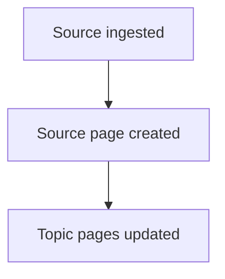

# CLAUDE.md — Wiki Schema and Operational Instructions

**Document status:** Design draft. Not yet in the execution environment.
**Authority:** This document governs all wiki maintenance operations. When this document
conflicts with chat history or any other source, this document takes precedence.
**Portability note:** This draft was produced in a Claude.ai design project. Before use
in the execution environment (Claude Code, git repo), verify all environmental assumptions
in each section marked [ENV].

---

## 1. Purpose and Scope

You are maintaining a structured, interlinked knowledge wiki on AI effectiveness for a
small technical team. The wiki covers: AI tools and workflows (consumer and enterprise),
emerging capabilities and their taxonomies, AI alignment and performance tradeoffs, and
novel methodologies and applications.

Your responsibilities:
- Ingest new sources and integrate their knowledge into the wiki
- Maintain cross-references, page currency, and structural consistency
- Resolve contradictions per the protocol in Section 8
- Regenerate derived artifacts (Teaching Index, Overview counters) after each ingest
- Execute lint passes when instructed

You do not make judgment calls that are not covered by this document. When a situation
is not covered, stop and surface the gap rather than improvising a convention.

Before beginning any ingest or lint operation, read the relevant skill file:
- Ingest: `EXTRACTION-SKILL.md`, `TAGGING-SKILL.md`
- Contradiction handling: `CONTRADICTION-SKILL.md`
- At session start for any operation involving prior human overrides: read only the
  relevant section of `wiki-lessons-learned.md` (organized by operation type)

[ENV] Skill files live in the wiki root alongside CLAUDE.md. Starter templates for all
three skill files are produced as design project output. Copy them to the wiki root as
part of the initialization scaffold (see Section 2.1) before the first ingest.

---

## 2. Repository Structure

```
wiki/
├── CLAUDE.md                    ← this file; excluded from Quartz rendering
├── EXTRACTION-SKILL.md          ← ingest extraction examples; excluded from Quartz
├── TAGGING-SKILL.md             ← teaching relevance tagging examples; excluded from Quartz
├── CONTRADICTION-SKILL.md       ← contradiction path examples; excluded from Quartz
├── index.md                     ← singleton; catalog of all pages
├── overview.md                  ← singleton; wiki entry point and counters
├── log.md                       ← singleton; append-only operation log
├── teaching-index.md            ← singleton; derived artifact, regenerated on ingest/lint
├── wiki-lessons-learned.md      ← singleton; append-only precedent log; excluded from Quartz
├── assets/                      ← operational images for LLM reference; excluded from Quartz rendering
│                                    (files here are NOT served by the public site — use quartz/static/ for
│                                     any image or document that must render in the Quartz-published site)
├── raw/
│   ├── staged/                  ← local source files awaiting ingest
│   ├── processed/               ← post-ingest archive; staged files moved here after ingest;
│   │                                gitignored (same policy as staged/); pruned by human periodically
│   ├── queue.md                 ← URL queue and override signals, synced across machines via git
│   ├── discovery-sources.md     ← feed list for proactive discovery pass
│   ├── collection-gaps.md      ← persistent collection gap recommendations; updated by lint
│   └── deferred-ingest.md      ← ephemeral; created when ingest is aborted at Step 0;
│                                   deleted when the deferred items are processed;
│                                   committed to git on creation
├── topics/                      ← Topic pages
├── tools/                       ← Tool/Product pages
├── sources/                     ← Source pages
├── comparisons/                 ← Comparison pages
└── pitfalls/                    ← Pitfalls pages
```

[ENV] The following must be set in `quartz.config.ts` before the wiki is published:
```
ignorePatterns: [
  "CLAUDE.md", "EXTRACTION-SKILL.md", "TAGGING-SKILL.md",
  "CONTRADICTION-SKILL.md", "wiki-lessons-learned.md",
  "assets/**", "raw/**", "docs/**", "content/**", "prompts/**",
  "node_modules/**", "INIT-PROMPT.md", "public/**",
  "overview.md", "log.md"
]
```
Do NOT add `"index.md"` to this list — Quartz requires it to generate the root
`index.html` home page. Excluding it causes browsers to receive `index.xml` (the
RSS feed) instead of the site interface.
If this is not configured, operational files, build output, and raw sources will be
rendered as wiki pages. Verify this before the first Quartz build.

[ENV] The staging directory default is `raw/staged/`. Confirm this path before first
ingest. Claude Code must not assume a different path.

---

## 2.1 Initialization Scaffold

The following files must be created by the human before the first Claude Code session.
Claude Code reads these files at the start of every operation. If any required file is
absent, stop and surface the gap — do not improvise initial values.

**Four singleton files with exact initial content:**

`overview.md`:
```yaml
---
type: overview
title: Wiki Overview
created: YYYY-MM-DD
updated: YYYY-MM-DD
total_pages: 0
total_sources: 0
open_contradictions: 0
last_contradiction_id: 0
---
```

`index.md`:
```yaml
---
type: index
title: AI Effectiveness Wiki
created: YYYY-MM-DD
updated: YYYY-MM-DD
---

This wiki tracks AI tools, capabilities, workflows, and failure modes for practitioners
who need to evaluate and apply AI in professional settings. Content is organized by
concept area, product, and use case — updated continuously as new sources are ingested.

Browse by category below. For content aligned to specific learning objectives and
professional roles, see the [[teaching-index]].

*0 pages. Last updated: YYYY-MM-DD.*

---

## Topics

## Tools

## Sources

## Comparisons

## Pitfalls
```

**Note:** At initialization the At a Glance line uses `0` for the page count and today's
date. Claude Code updates both values after each ingest per the generation rule in
Section 12.

`log.md`:
```yaml
---
type: log
title: Operation Log
created: YYYY-MM-DD
updated: YYYY-MM-DD
last_entry: YYYY-MM-DD
entry_count: 0
---
```

`teaching-index.md`:
```yaml
---
type: teaching-index
title: Teaching Index
created: YYYY-MM-DD
updated: YYYY-MM-DD
---

*Generated on first ingest that touches a page tagged teaching_relevance: true.*
```

**Three raw/ files:**

`raw/queue.md` — create with exactly these four section headers and no other content:
```markdown
## [queued]

## [nominated]

## [stale-nominated]

## [processed]
```

Entries move from `## [queued]` to `## [processed]` after successful ingest, with
`processed: YYYY-MM-DD` appended to the original entry line. The `## [processed]`
section accumulates indefinitely; the human prunes it periodically. The schema does
not automate pruning.

`raw/collection-gaps.md`:
```markdown
# Collection Gaps
Last updated: YYYY-MM-DD (initialization)

## Active Gaps

## Potentially Addressed

## Resolved
```

`raw/discovery-sources.md` — populated by the human with the initial feed list before
the first discovery pass. Format: `{url} | {type: arxiv | lab-blog | academic-blog} | {label}`.

**Skill files and operational singletons:**

Copy `EXTRACTION-SKILL.md`, `TAGGING-SKILL.md`, and `CONTRADICTION-SKILL.md` from
design project output to the wiki root before the first ingest. Do not run ingest
without `EXTRACTION-SKILL.md` at minimum.

Create `wiki-lessons-learned.md` with the required frontmatter (Section 5.9) and
five empty operation-type sections: `## Ingest`, `## Contradiction`, `## Tagging`,
`## Lint`, `## Query`, `## Schema Signals`.

Replace all `YYYY-MM-DD` placeholders with the actual initialization date.

---

## 3. Page Types

The wiki uses exactly eight page types. Every file in the wiki (excluding operational
singletons and skill files) is one of these types. Do not create page types not listed
here. If a need arises that no type satisfies, surface it rather than improvising.

| Type | Directory | Scope |
|---|---|---|
| Topic | `topics/` | A concept, methodology, domain area, or emergent phenomenon |
| Tool/Product | `tools/` | A specific named AI tool, product, model, or service |
| Source | `sources/` | A single ingested source document |
| Comparison | `comparisons/` | A structured comparison of two or more Tools or Topics |
| Pitfalls | `pitfalls/` | Failure modes, limitations, and antipatterns for a Tool or Topic |
| Overview | root | Singleton wiki entry point |
| Log | root | Singleton append-only operation record |
| Wiki Lessons Learned | root | Singleton append-only precedent log (operational only) |

**Topic vs. Tool/Product:** Topic pages cover concepts that are not specific named products.
Tool/Product pages cover things a user selects by name when configuring a workflow. If in
doubt: does the entity have a vendor, a version number, or a pricing tier? If yes, it is
a Tool/Product page.

**Comparison pages are first-class artifacts.** When you produce a comparison in response
to a query, file it as a Comparison page. Do not let comparison results disappear into
session history. Comparison page creation always requires human confirmation via
pre-flight forced choice before any file is written.

---

## 4. Naming Conventions

### Universal rules
- All filenames: all-lowercase kebab-case, no spaces, no uppercase characters, `.md` extension
- These rules are absolute. macOS allows uppercase; Linux CI does not. Uppercase creates
  silent collisions on macOS that become hard failures on GitHub Actions.

### Per-type patterns

**Topic:** `topics/{concept-slug}.md`
- Slug is the kebab-case rendering of the concept name
- Examples: `topics/retrieval-augmented-generation.md`, `topics/chain-of-thought-prompting.md`

**Tool/Product:** `tools/{vendor-slug}-{product-slug}.md`
- Vendor prefix is mandatory on all Tool pages without exception
- Exception: when vendor name and product name are identical, use product slug alone
  (e.g., `tools/cursor.md` not `tools/cursor-cursor.md`)
- For model-class tools, always encode the version identifier in the slug at page creation,
  even if no prior version page exists yet
  (e.g., `tools/anthropic-claude-opus-4.md`, `tools/openai-gpt-4o.md`)
- Examples: `tools/openai-gpt-4o-mini.md`, `tools/google-gemini-pro.md`

**Source:** `sources/{year}-{title-slug}.md`
- Year is the publication year in 4-digit format
- Title slug: 4–6 meaningful words, stopwords stripped, generated by you at ingest time
- Undated sources: `sources/undated-{title-slug}.md`
- Examples: `sources/2024-karpathy-llm-wiki-pattern.md`, `sources/2023-sparks-agi-microsoft.md`
- The human does not set source filenames. You derive the slug from the source title.

**Comparison:** `comparisons/{slug-a}-vs-{slug-b}.md` for binary comparisons;
`comparisons/{use-case-slug}-comparison.md` for three or more entities
- Binary form uses the full filename slug of each entity (minus directory and extension)
- Examples: `comparisons/openai-gpt-4o-vs-anthropic-claude-opus-4.md`,
  `comparisons/rag-architectures-comparison.md`

**Pitfalls:** `pitfalls/{parent-slug}-pitfalls.md`
- Parent slug is the filename slug of the parent entity (minus directory and extension)
- Examples: `pitfalls/openai-gpt-4o-pitfalls.md`,
  `pitfalls/retrieval-augmented-generation-pitfalls.md`

**Singletons** (fixed, not negotiable):
- `overview.md`, `log.md`, `index.md`, `teaching-index.md`, `CLAUDE.md`,
  `wiki-lessons-learned.md`

### Wikilink convention
Obsidian resolves wikilinks by shortest unique filename match. Use short-form wikilinks
in prose: `[[openai-gpt-4o]]`.

**Exception — structural frontmatter fields only:** Use full-path wikilinks in
`entities_compared` and `parent_entity` frontmatter fields to enable unambiguous
lint type enforcement: `[[tools/openai-gpt-4o]]` not `[[openai-gpt-4o]]`.

Before creating any new page, verify the filename is unique across the entire repo.
If a collision exists, surface it rather than silently overwriting.

---

## 5. Frontmatter Specifications

YAML frontmatter is mandatory on every page. Fields marked **required** must be present
on every page of that type. Fields marked **conditional** are required when their
condition is met. Fields marked **optional** may be omitted if not applicable.

### 5.1 Universal Fields (all page types)

```yaml
type:    # required | controlled: topic | tool | source | comparison | pitfalls | overview | log
title:   # required | free text; must match the human-readable portion of the filename
created: # required | ISO 8601: YYYY-MM-DD
updated: # required | ISO 8601; set on every write to this file
aliases: # optional | list of strings; alternate names for Obsidian wikilink resolution
```

### 5.2 Topic Page

```yaml
type: topic
title:
created:
updated:
aliases:
summary:             # required | single sentence; written at creation, updated on
                     #   substantive revision; used for index.md entries and search snippets
status:              # required | controlled: stub | developing | current | stale
source_count:        # required | integer; increment on each ingest that touches this page
last_assessed:       # optional | ISO 8601; set when claims are actively evaluated against
                     #   current sources — not on every write. Set by you on lint/ingest
                     #   evaluation passes; may also be set manually by the wiki owner.
related_topics:      # optional | list of short-form wikilinks to Topic pages only
related_tools:       # optional | list of short-form wikilinks to Tool/Product pages only
teaching_relevance:  # optional | boolean; if true, competency_domains and
                     #   professional_contexts become required
competency_domains:  # conditional | required when teaching_relevance: true
                     #   list; values from Section 7.1 only
professional_contexts: # conditional | required when teaching_relevance: true
                       #   list; values from Section 7.2 only
technical_depth:     # optional | controlled: foundational | practitioner | research
                     #   assigned by Claude Code at ingest without human confirmation
                     #   foundational — no AI/ML background required; concepts explained
                     #     from first principles; accessible to non-technical professionals
                     #   practitioner — requires familiarity with AI/ML concepts;
                     #     suitable for developers, product managers, data scientists
                     #   research — assumes deep AI/ML background or equivalent
                     #     research-level familiarity with the subject area; covers
                     #     novel methods, theoretical results, empirical evaluations,
                     #     or advanced alignment and policy analysis
```

**Status definitions:**
- `stub` — page created, minimal content present
- `developing` — substantive content present, not yet comprehensive
- `current` — comprehensive and assessed within 90 days with no unresolved contradiction flags
- `stale` — last assessed more than 90 days ago, or a Key Claim has been flagged by a newer source

### 5.3 Tool/Product Page

```yaml
type: tool
title:
created:
updated:
aliases:
summary:             # required | same rules as Topic
status:              # required | controlled: active | emerging | deprecated | discontinued | stub
vendor:              # optional | free text; company or open-source project name
pricing_model:       # optional | controlled: free | freemium | subscription |
                     #   usage-based | enterprise | open-source
access_tier:         # optional | list | controlled: consumer | prosumer | enterprise | api
capabilities:        # optional | list of brief strings, one clause per item, no prose
                     #   RAG extraction anchor; see Section 6.3 for constraints
limitations:         # optional | list of brief strings; same constraint as capabilities
primary_use_cases:   # optional | list of brief labels; aids landscape/comparison queries
source_count:        # required | integer
last_assessed:       # optional | ISO 8601; same rules as Topic
related_tools:       # optional | list of short-form wikilinks to Tool/Product pages only
related_topics:      # optional | list of short-form wikilinks to Topic pages only
teaching_relevance:  # optional | boolean
competency_domains:  # conditional | same as Topic
professional_contexts: # conditional | same as Topic
technical_depth:     # optional | same rules and values as Topic
superseded_by:       # conditional | full-path wikilink; required when status: deprecated
```

**Status definitions:**
- `active` — tool is generally available and production-ready
- `emerging` — tool is in early access, preview, or beta
- `deprecated` — tool has a planned end-of-life; `superseded_by` required; excluded from
  lint staleness checks and Teaching Index generation
- `discontinued` — tool is no longer available
- `stub` — page created but lacks valid source coverage; pending re-ingest. Set only by
  the ingested-in-error correction procedure (Section 8.6). Because `last_assessed` is
  cleared on stub creation (Section 8.6 Step IE-4 option B), lint staleness checks do
  not flag stub pages. Do not set this status manually outside the correction procedure.

### 5.4 Source Page

Source pages are created once at ingest and are not updated afterward, with three
exceptions: (1) populate `superseded_by` when a later source replaces this one; (2)
correct `status` when a retraction or ingested-in-error correction is initiated by the
human; (3) set `enriched` and update `updated` when source enrichment is executed (Step
2a). All other fields are immutable after creation.

```yaml
type: source
title:
created:
updated:
aliases:
status:           # required | controlled: active | retracted | ingested-in-error
                  #   Default: active.
                  #   active: source is valid and citable.
                  #   retracted: source was valid at ingest; subsequently invalidated by its
                  #     issuer or by community consensus. Set by human only. Triggers the
                  #     retraction procedure (Section 8.2). Source page is never deleted.
                  #   ingested-in-error: source was never valid; ingested by mistake. Set by
                  #     human only. Triggers the correction procedure (Section 8.6). Source
                  #     page is never deleted. Do not use for superseded sources.
source_type:      # required | controlled: research-paper | industry-blog | white-paper |
                  #   publication-article | youtube-video | podcast-transcript |
                  #   practitioner-reference | vendor-content | policy-document
author:           # optional | string or list of strings
publication:      # optional | free text; journal, outlet, or channel name
published_date:   # optional | ISO 8601; omit if genuinely unavailable; do not fabricate
ingested_date:    # required | ISO 8601; set at ingest time; immutable after creation
enriched:         # optional | ISO 8601; set by Step 2a when a richer version of this
                  #   source is ingested to replace shallow extraction. Absent on first
                  #   ingest. Present only when enrichment has occurred. Immutable
                  #   thereafter except if enrichment is performed a second time.
ingest_via:       # optional | controlled: queue | staged
                  #   queue: URL fetched by Claude Code from raw/queue.md [queued]
                  #   staged: local file processed from raw/staged/
                  #   Set at ingest time (Step 10). Immutable after creation.
                  #   Absent on pages ingested before this field was added.
url:              # optional | canonical URL; omit for offline-only sources
transcript_file:  # conditional | required when source_type: youtube-video or podcast-transcript
                  #   path to the transcript file relative to wiki root
credibility_tier: # required | controlled: peer-reviewed | institutional |
                  #   practitioner | community
                  #   You assign this at ingest time per Section 10.1 Step 4
extraction_depth: # required | controlled: full | standard
                  #   Set at ingest time per source type:
                  #   full: research-paper | white-paper | policy-document
                  #   standard: all other types
related_topics:   # optional | list of short-form wikilinks to Topic pages this source
                  #   contributed to
related_tools:    # optional | list of short-form wikilinks to Tool pages this source
                  #   contributed to
superseded_by:    # optional | full-path wikilink; populate only when a later source
                  #   replaces this one; immutable thereafter
```

**Body (required):** One paragraph, 2–5 sentences. State the central argument, key
findings or claims, and any notable scope limitations or caveats. Plain prose. Present
tense. Written by the agent at ingest time from the extraction pass. Do not include
citations or wikilinks. Immutable after first creation, with one exception: when Step 2a
(source enrichment) has been executed, this paragraph is rewritten from the richer
source as part of the enrichment pass.

### 5.5 Comparison Page

```yaml
type: comparison
title:
created:
updated:
aliases:
comparison_type:   # required | controlled: tool-vs-tool | methodology-vs-methodology |
                   #   approach-vs-approach
entities_compared: # required | list of full-path wikilinks; minimum 2 entries;
                   #   must resolve to Tool/Product or Topic pages only
                   #   Example: ["[[tools/openai-gpt-4o]]", "[[tools/anthropic-claude-opus-4]]"]
use_case:          # required | free text; the decision context this comparison serves
status:            # required | controlled: current | stale | superseded
source_count:      # required | integer; count of sources underlying referenced pages
                   #   at time of generation; informational only
related_topics:    # optional | list of short-form wikilinks
```

**Staleness dependency:** When any page in `entities_compared` is updated, this Comparison
page becomes potentially stale. The lint procedure flags any Comparison page whose `updated`
date is older than the `updated` date of any page in `entities_compared`.

### 5.6 Pitfalls Page

```yaml
type: pitfalls
title:
created:
updated:
aliases:
parent_entity:    # required | full-path wikilink to the parent Tool or Topic page
                  #   Example: [[tools/openai-gpt-4o]]
parent_type:      # required | controlled: tool | topic
status:           # required | controlled: current | stale
failure_mode_count: # optional | integer; total count of failure mode entries across
                    #   all three body sections; aids lint health checks
teaching_relevance:  # optional | boolean
competency_domains:  # conditional | same as Topic
professional_contexts: # conditional | same as Topic
```

**Mandatory body structure:** Every Pitfalls page must contain all three of the following
sections as H2 headings, in this order. A section may be brief but may not be omitted.

```markdown
## Technical Limitations
## Usage Antipatterns
## Alignment and Safety Concerns
```

Each failure mode entry within any section must include an explicit status on the line
immediately following the failure mode heading:

```markdown
### [Failure mode name]
**Status:** active | mitigated | unresolved | speculative
```

**Routing rule:** Cross-cutting usage antipatterns that are not specific to a single tool
belong on Topic-scoped Pitfalls pages. Do not duplicate a cross-cutting antipattern across
multiple Tool Pitfalls pages.

### 5.7 Overview Page

```yaml
type: overview
title: Wiki Overview
created:
updated:
total_pages:            # required | integer; update on every wiki write
total_sources:          # required | integer; update on every ingest
last_lint:              # optional | ISO 8601; update after each lint pass completes
last_discovery:         # optional | ISO 8601; update after each discovery pass completes
open_contradictions:    # optional | integer; update after lint
last_contradiction_id:  # required | integer; global CTRD-NNN counter; read before
                        #   assigning a new ID, increment after assignment; initialize to 0
```

**Initialization values:** `overview.md` is created by the human as part of the
pre-session initialization scaffold (see Section 2.1). Set the following field values
at initialization:

```yaml
total_pages: 0
total_sources: 0
open_contradictions: 0
last_contradiction_id: 0
```

Omit `last_lint` and `last_discovery` at initialization. Both are optional fields;
Claude Code sets `last_lint` after the first lint pass and `last_discovery` after the
first discovery pass.

### 5.8 Log Page

```yaml
type: log
title: Operation Log
created:
updated:
last_entry:   # required | ISO 8601; update on every append
entry_count:  # required | integer; increment on every append
```

Log entries use a consistent prefix to enable unix-tool parsing:

```
## [YYYY-MM-DD] {operation} | {description}
```

Where `{operation}` is one of: `ingest`, `query`, `lint`, `contradiction-flag`,
`contradiction-resolved`, `contradiction-auto-resolved`, `schema-change`,
`discovery-pass`, `retraction`, `ingested-in-error-correction`, `skill-enrichment`,
`session-stats`.

### 5.9 Wiki Lessons Learned Page

```yaml
type: wiki-lessons-learned
title: Wiki Lessons Learned
created:
updated:
last_entry:   # required | ISO 8601
entry_count:  # required | integer
```

Entries are organized under H2 headings by operation type: `## Ingest`, `## Contradiction`,
`## Tagging`, `## Lint`, `## Query`, `## Schema Signals`. Within each section, entries are append-only,
newest last. Entry format:

```markdown
### [YYYY-MM-DD] {one-line title}
**Operation:** ingest | contradiction | tagging | lint | query | schema-signal
**What happened:** [one sentence describing the case]
**What was wrong:** [one sentence on the error or gap]
**Correct behavior:** [one sentence on what should have happened]
**Signal for future cases:** [one actionable rule Claude Code can apply]
```

`## Schema Signals` entries use a distinct format written by lint Step L12c (auto-execute,
no human confirmation required):

```markdown
### [YYYY-MM-DD] Override pattern: {category}
**Operation:** schema-signal
**Override count:** {N} in past 30 days
**Date range:** YYYY-MM-DD to YYYY-MM-DD
**Hypotheses:**
  1. Schema definition overlap — definitions allow the same content to qualify for multiple types
  2. Inference gap — agent cannot reliably route this content from available source signals
  3. Human preference drift — the human's intended definition has shifted; schema may be correct
  4. Vocabulary gap — no type covers this case; schema needs a new entry
  5. Source ambiguity — source is genuinely dual-natured; precedent entry is the resolution
**Status:** open | resolved YYYY-MM-DD (DM-NNN)
```

When a Schema Signals entry is resolved (root cause identified and addressed), set
`**Status:** resolved YYYY-MM-DD (DM-NNN)` in place — this is the only permitted
in-place edit on a Schema Signals entry.

You draft a new entry after any ingest or lint pass where the human overrode your
decision. The human confirms or discards the draft as part of the post-ingest review.
You do not write entries about your own errors without a human override as the trigger.

---

## 6. Content Standards

### 6.1 Key Claims Section

Every Topic and Tool/Product page must contain a Key Claims section. This is the
provenance anchor for the page.

```markdown
## Key Claims

| Claim | Source | Date | Status | Support Score | Decay Exempt |
|---|---|---|---|---|---|
| [One-sentence claim] | [[source-slug]] | YYYY-MM-DD | current \| superseded \| contested | N | false |
```

**Field definitions:**

- **Claim:** One assertable sentence — not a topic label, not a question.
- **Source:** Short-form wikilink to the Source page. Multiple sources: comma-separated.
  Exception: when a Key Claim is derived from a query result filing (see Section 11.5
  Step Q7), the Source field contains a wikilink to a Topic or Tool page rather than a
  Source page. Annotate these with `[derived]` appended to the wikilink:
  `[[topic-slug]] [derived]`. Lint must not flag `[derived]`-annotated claims as
  sourcing gaps during schema conformance checks.
  `[minority view]`-annotated sources in the Source field are not counted toward the
  incumbent support score and are not flagged as sourcing gaps.
- **Date:** Publication date of the primary source. If multiple sources, use the most recent.
- **Status:** `current` | `superseded` | `contested`
  When multiple CTRD flags are open on a single row, all IDs appear in the Status cell:
  `contested [CTRD-003] [CTRD-004]`. See Section 8.5 for stacking rules.
- **Support Score:** Calculated as the sum of credibility weights of all supporting sources,
  excluding `[minority view]`-annotated sources, with decay applied to sources older than
  12 months (half weight after 12 months). Weights: peer-reviewed=3, institutional=2,
  practitioner=1, community=0. You recalculate this on every ingest pass that touches the
  page and on every lint pass. For `[derived]` claims, Support Score is calculated from
  the source_count of the referenced wiki pages as a proxy; record as `derived` rather
  than a numeric score.
- **Decay Exempt:** `true` | `false`. Default: `false`. Set to `true` only when the human
  confirms via forced choice. You may propose `decay_exempt: true` when all three conditions
  are met: (a) the claim is definitional or foundational, not empirical; (b) no contradiction
  has ever been flagged against it; (c) it is supported by at least two independent
  peer-reviewed or institutional sources. You never set this field autonomously.

**Rules:**
- 3–5 claims per page. Not fewer, not more without strong justification.
- Claims must be the most consequential and time-sensitive assertions on the page.
- Each claim must be traceable to a specific Source page via wikilink, except for
  `[derived]` claims as noted above.
- When a new source contradicts a Key Claim, apply the three-path contradiction protocol
  in Section 8. Do not silently overwrite.

**Self-check before writing Key Claims:** Verify — (a) claim count is 3–5; (b) each claim
has a source wikilink or `[derived]` annotation; (c) each claim is a single assertable
sentence, not a topic label; (d) Support Score is calculated and populated. If any check
fails, correct before writing.

### 6.2 Prose Sections

Prose uses rolling overwrite. You update narrative sections to reflect the current
synthesis. No historical trail is preserved in prose — that function belongs to the
Key Claims section and the Source pages.

Write prose in the present tense. Avoid hedging language that obscures the current
state of knowledge. If a claim is genuinely uncertain, say so explicitly with a reason,
not with vague qualifiers.

**Length constraint:** Target 600–800 words of prose body per Topic or Tool page,
excluding frontmatter, Key Claims table, and section headers. Hard ceiling: 1,200 words.
Rolling overwrite must synthesize and compress, not accumulate. If a pass cannot reduce
a section while preserving its meaning, the section needs splitting, not expanding.

**Page split protocol:** When a Topic or Tool page's prose body exceeds 1,200 words
after a rolling overwrite pass, propose a split in the pre-flight report as a forced
choice: a primary page retaining the high-level synthesis, and one or more companion
pages for depth. The primary page links to companions explicitly. You do not split pages
autonomously. The human confirms the split before any files are written or renamed.

**Section-targeted updates:** For ingest passes that touch a page minimally — adding
one Key Claim or updating one prose section — update only the affected section rather
than rewriting the full page. Full-page rewrites are reserved for passes where the
source materially changes the overall synthesis.

### 6.3 RAG Structural Note — capabilities and limitations Fields

The `capabilities` and `limitations` fields on Tool/Product pages currently use
list-of-brief-strings format. Each item is one clause, no prose. This preserves
partial RAG utility without committing to a rigid typed object structure.

If the RAG use case is activated — wiki pages used as runtime agent input for
programmatic methodology comparison — these fields must be revised to typed YAML
objects. That revision requires a schema change and a log entry. Do not make this
change unilaterally.

### 6.4 Mermaid Diagrams

Generate Mermaid diagrams directly in page content wherever a flow diagram, process
visualization, or structural diagram adds genuine value. Mermaid is the default for
all diagrammatic content — it is text-based, version-controlled, and renders natively
in both Obsidian and Quartz without plugins.

````markdown

````

Do not source or generate raster images as part of automated wiki maintenance. Static
images (logos, screenshots, photos) are stored in `assets/` and referenced manually
by the wiki owner. AI-generated imagery is out of scope.

### 6.5 Spot-Check for Authoritative Sources

For every source with `credibility_tier: peer-reviewed` or `source_type: policy-document`,
after completing the Key Claims extraction for that source, output a spot-check block in
the post-ingest summary:

```
Spot-check — [[source-slug]]:
  Claim: [extracted claim text]
  Source passage: "[verbatim sentence or clause from source supporting this claim]"
  ...repeat for each Key Claim extracted from this source...
```

This allows the human to verify extraction fidelity without reading the full source.
Do not omit this step for authoritative sources.

---

## 7. Controlled Vocabularies

Both vocabularies are controlled. Do not use values outside these lists during ingest
or tagging. If a concept does not map to any existing term, surface the gap rather than
inventing a new tag.

Additions to either vocabulary require a schema revision and a DM entry in the design
project governance log.

### 7.1 Professional Competency Domains

Use these exact kebab-case values in `competency_domains` fields:

| Value | Covers |
|---|---|
| `tool-evaluation-and-selection` | Assessing and choosing AI tools for specific use cases |
| `practical-ai-use-and-interaction` | Task-level use: prompting, iteration, output refinement |
| `ai-integration-in-organizational-workflows` | Embedding AI into multi-actor processes with accountability structures |
| `output-verification-and-risk-assessment` | Checking outputs and evaluating workflow failure modes |
| `ai-safety-and-alignment-literacy` | Understanding alignment tradeoffs and safety-relevant behaviors |
| `capability-horizon-awareness` | Tracking emerging capabilities and their taxonomies |
| `attribution-ip-and-professional-integrity` | Attribution norms, IP considerations, and disclosure practices across academic and professional contexts |

### 7.2 Professional Context Terms

Use these exact kebab-case values in `professional_contexts` fields:

| Value |
|---|
| `activism-and-civic-advocacy` |
| `non-profit-and-ngo-work` |
| `journalism-and-media` |
| `legal-practice` |
| `domestic-civil-service-and-public-administration` |
| `foreign-service-and-diplomacy` |
| `organizational-leadership-and-change-management` |
| `project-and-program-management` |
| `teaching-and-instruction` |
| `graduate-and-doctoral-education` |
| `professional-and-continuing-education` |
| `entrepreneurship-and-startups` |

### 7.3 Teaching Relevance Confidence Threshold

Propose `teaching_relevance: true` as a forced choice when a page meets either criterion:
- Maps cleanly to two or more competency domains from Section 7.1 (no interpretive judgment required)
- Maps strongly to one competency domain with substantive coverage (multiple paragraphs, not a passing mention)

Present the proposed domains in the forced choice for human verification:

```
[N] teaching_relevance proposed: [[page-slug]]
    Proposed domains: {domain-1}, {domain-2}
    A) Confirm — tag with proposed domains
    B) Confirm with edits — I will specify domains
    C) Decline
```

If neither criterion is met, do not propose the tag. The human can still set it manually.

---

## 8. Contradiction Resolution Protocol

### 8.1 Detection

A contradiction exists when a new source makes a claim that is directionally incompatible
with an existing Key Claim — not merely adds nuance or detail. Detect contradictions
during Steps 9 and 10 of the ingest workflow.

### 8.2 Three-Path Resolution

**Path labels in this section (A/B/C) are structural labels for explaining the logic.
All machine-readable field values use operational aliases: `auto-resolved`,
`human-review`, `minority-view`. See Section 8.3 for field specifications.**

Calculate the incoming source's credibility weight and compare it against the existing
Key Claim's Support Score. Apply the following paths using precedence order — the first
condition that fires determines the path:

**Path B — Flag for human review. (Test first.)**
Condition: the absolute difference between incoming source weight and existing Support Score
is 2 or less, regardless of direction.
Action: set claim status to `contested`. Update prose to reflect the newer view
(rolling overwrite proceeds). Create a contradiction flag (Section 8.3). Log a
`contradiction-flag` entry. Surface to human in post-ingest summary as a required action
with the 7-day override window start date.

**Path A — Auto-resolve in favor of new source. (Test second.)**
Condition: incoming source weight exceeds the existing Support Score by more than 2
(difference > 2, incoming > existing).
Action: update prose (rolling overwrite), update the Key Claim to reflect the new view,
recalculate Support Score, set claim status to `current`. Log a
`contradiction-auto-resolved` entry. Surface in post-ingest summary as an informational
note under a distinct heading ("Auto-resolved contradictions"), not as a required action.
For Path A resolutions on pages with `status: current`, apply additional prominence in
the summary — list the page, the old claim, and the new claim explicitly.

**Path C — Record as minority view. (Test third.)**
Condition: existing Support Score exceeds incoming source weight by more than 2
(difference > 2, existing > incoming).
Action: add the dissenting source to the Key Claim's Source field with a `[minority view]`
annotation. Do not change claim status. Do not flag for human review. Log a
`contradiction-flag` entry at informational level.

**Credibility weights:**
- `peer-reviewed`: 3
- `institutional`: 2
- `practitioner`: 1
- `community`: 0 — not eligible to anchor Key Claims

**Score decay:** Sources older than 12 months contribute half their weight to Support Score
calculations. Recalculate on every ingest pass touching the page and on every lint pass.
Exclude `[minority view]`-annotated sources from incumbent Support Score calculations.

**Retraction override:** A retraction event always triggers Path B regardless of score.
When a Source page `status` is set to `retracted` by the human, immediately identify
every Key Claim across the wiki whose Source field references this page as its sole
non-minority-view citation. Present each as a forced choice:

```
[N] Retraction impact: [[page-slug]] — Key Claim: [claim text]
    This claim has no other supporting source.
    A) Remove the claim
    B) I will provide a replacement source
    C) Downgrade page status to stale and leave claim contested
```

### 8.3 Contradiction Flag Format

A contradiction flag has two components: a frontmatter entry on the affected page, and
an inline marker in the Key Claims table row. Both are required. Neither alone is
sufficient — the frontmatter entry is machine-readable by Claude Code during lint; the
inline marker is visible to a human reading the page in Obsidian or Quartz.

**Frontmatter entry — `open_contradictions` list:**

```yaml
open_contradictions:
  - id: "CTRD-NNN"
    claim_summary: "One-sentence paraphrase of the contested claim"
    contesting_source: "[[year-title-slug]]"
    flagged_date: "YYYY-MM-DD"
    override_window_closes: "YYYY-MM-DD"
    path: "human-review"
```

- `open_contradictions` is a list. Multiple simultaneous contested claims on one page
  are supported — each has its own list entry.
- The field is absent (not present, not blank) when no open contradictions exist.
- `path` uses operational aliases only: `auto-resolved` | `human-review` | `minority-view`.
  Path B flags always use `human-review`.

**ID generation:** `CTRD-NNN` where NNN is a zero-padded integer incremented globally
across the wiki. Read `last_contradiction_id` from `overview.md` before assigning a new
ID. Increment `last_contradiction_id` in `overview.md` after assignment. Do not reuse IDs.

**Inline marker in the Key Claims table:**

Append `contested [CTRD-NNN]` to the Status cell of the contested claim row:

```markdown
| [claim text] | [[source-slug]] | YYYY-MM-DD | contested [CTRD-NNN] | N | false |
```

When multiple CTRD flags are open on the same row, all IDs appear in the Status cell,
space-separated:

```markdown
| [claim text] | [[source-slug]] | YYYY-MM-DD | contested [CTRD-003] [CTRD-004] | N | false |
```

Lint step L4b must handle pages where the Status cell contains more than one CTRD
reference — surface each as a separate forced choice.

When a contradiction is resolved, remove only the resolved CTRD ID from the Status cell.
If the cell then contains no remaining CTRD IDs, update the Status to `current` or
`superseded` as appropriate.

### 8.4 Override Mechanism

The override mechanism uses a reserved syntax in `raw/queue.md`. No additional tooling
is required. queue.md is already synced across machines via git.

**Human action:** Within the 7-day window, the human adds one of the following lines
to `raw/queue.md`:

```
CTRD-NNN:override [optional one-line rationale]
CTRD-NNN:confirm [optional one-line rationale]
```

These lines are syntactically distinct from URL entries and cannot be mistaken for
source queue items. Claude Code scans queue.md for `CTRD-NNN:` lines at the start of
every lint pre-flight pass (Step L1) and every ingest pre-flight pass, before processing
any sources.

Two mechanisms surface open contradictions for human action:
1. **queue.md signals** — human acts proactively by adding a line to queue.md.
2. **Lint forced choices** — open contradictions within their window are surfaced as
   forced choices during lint (Step L4b), with an explicit skip option if the human
   is not ready to act. The human need not remember to use queue.md; lint will put
   open items in front of them.

**Outcome: CTRD-NNN:override (human disagrees with Path B resolution)**

1. Locate the affected page by matching CTRD-NNN in `open_contradictions` frontmatter.
2. Revert the Key Claims table: restore prior claim text, set status to `current`,
   remove `contested [CTRD-NNN]` from the Status cell (leaving any other CTRD IDs intact).
3. Add the contesting source to the claim's Source field with `[minority view]`
   annotation (retroactive Path C treatment).
4. Remove the CTRD-NNN entry from `open_contradictions` frontmatter. If the list
   becomes empty, remove the field entirely.
5. Write `contradiction-resolved` log entry with `resolution: overridden`.
6. Remove the `CTRD-NNN:override` line from queue.md.
7. Decrement `open_contradictions` counter in `overview.md`.

**Outcome: CTRD-NNN:confirm (human agrees with Path B resolution)**

1. Locate the affected page.
2. Update Key Claims: set prior claim status to `superseded`; add new claim from
   contesting source with status `current`. If the contesting source directly replaces
   the claim text, update in place and set status to `current`.
3. Remove `contested [CTRD-NNN]` from the Status cell (leaving any other CTRD IDs intact).
4. Remove the CTRD-NNN entry from `open_contradictions` frontmatter.
5. Write `contradiction-resolved` log entry with `resolution: confirmed`.
6. Remove the `CTRD-NNN:confirm` line from queue.md.
7. Decrement `open_contradictions` counter in `overview.md`.

**Outcome: window expires (no signal received by day 8)**

Window expiry is detected during any lint pass that runs after the
`override_window_closes` date. Claude Code does not poll daily — expiry is processed
on the next scheduled or on-demand lint pass. The effective window may therefore exceed
7 days if lint runs infrequently. This is acceptable and expected; document it when
surfacing expiry events in lint output.

1. Lint Step L4a detects that `override_window_closes` is before today's date and no
   queue.md signal exists for this CTRD-NNN.
2. Apply the same wiki state changes as the `confirm` outcome above.
3. Write `contradiction-resolved` log entry with `resolution: window-expired-confirmed`.
4. Decrement `open_contradictions` counter in `overview.md`.
5. Report in lint summary under "Expired contradiction flags — auto-confirmed."

### 8.5 Stacking Rules — Multiple Contradictions on One Claim

**Multiple Path C accumulations:** Minority views accumulate in the Source field without
limit. Each additional minority view source is appended with `[minority view]` annotation
and a new informational `contradiction-flag` log entry is written. No `open_contradictions`
frontmatter entry is created for Path C resolutions. Minority view sources are excluded
from the incumbent Support Score calculation at all times.

**New source arrives while claim is already contested (open Path B flag):**

Determine the new source's posture relative to the three-party state (incumbent claim,
existing contesting source, new source):

*Posture 1 — New source supports the contesting position.* Add the new source to the
contesting weight. Recalculate the combined contesting weight with decay applied.
Rerun path determination with the updated combined contesting weight against the
incumbent support score. If the outcome moves to Path A territory: auto-resolve, close
the CTRD entry with note "contesting weight increased above Path A threshold." If still
Path B: update the CTRD frontmatter entry's `contesting_source` field. Do not reset the
override window close date.

*Posture 2 — New source supports the incumbent.* Add the new source to the incumbent's
Source field. Recalculate the incumbent support score. Rerun path determination. If the
outcome moves to Path C territory: close the CTRD entry with note "incumbent score
increased above Path B threshold," write `contradiction-auto-resolved` log entry, remove
the inline CTRD marker, decrement `open_contradictions` counter in `overview.md`. If
still Path B: update the incumbent support score in the Key Claims table. Do not reset
the override window close date.

*Posture 3 — New source has a genuinely distinct third position.* Run the three-path
protocol for the new source against the incumbent support score independently. The
existing CTRD flag is not a factor in the calculation. Apply the outcome:
- Path A: Update the claim to the new position. Close the existing CTRD entry
  simultaneously — the original contesting source is also superseded. Add the original
  contesting source as `[minority view]` unless its position aligns with the new source's.
- Path B: Assign a new CTRD ID. The Status cell carries both IDs:
  `contested [CTRD-NNN] [CTRD-NNN+1]`. The `open_contradictions` list carries two entries.
  Update the prose to describe all competing positions — do not present either contesting
  view as settled.
- Path C: Record the new source as `[minority view]`. The existing CTRD flag is unchanged.

**Key constraint for dual Path B (two CTRD IDs on one row):** The Key Claims table row
always asserts one incumbent position. The claim text does not change until a CTRD entry
is resolved. The prose body (via rolling overwrite) must accurately describe the contested
state, naming the competing positions. The claim row is the provenance anchor; the prose
is where the contested picture lives for human readers.

---

### 8.6 Ingested-in-Error Correction Procedure

**Distinction from retraction:** A retracted source was valid at ingest and has since been
invalidated by its issuer or by community consensus. An ingested-in-error source was never
valid — it was ingested by mistake (wrong document, wrong domain, misclassified source).
The two procedures differ in three respects: (1) the status value set on the Source page
differs (`retracted` vs. `ingested-in-error`); (2) this procedure additionally closes any
open CTRD flags where the bad source is the *contesting* source, restoring the incumbent
claim unconditionally; and (3) this procedure handles pages created solely from the bad
source — the retraction procedure does not encounter orphaned pages because a retracted
source was legitimately ingested.

**Trigger:** The human sets `status: ingested-in-error` on a Source page. This is a
human-only action. Run the correction procedure immediately in the same session.

**The Source page is never deleted.** It remains with `status: ingested-in-error` as a
permanent provenance record documenting that the source was ingested and then corrected.

#### Step IE-1 — Pre-execution scope count

Identify:
- (a) Every Key Claim across the wiki whose Source field references this page as its sole
  non-minority-view citation.
- (b) Every page in the Source page's `related_topics` and `related_tools` fields with
  `source_count: 1`.

Count (a). If count exceeds 20, surface a warning before proceeding:

```
Ingested-in-error correction: [[source-slug]]
Warning: [N] Key Claims require resolution. This is a large correction pass.
A) Proceed
B) Abort
```

If B is selected: inform the human that the Source page `status` field must be manually
reverted to `active` if they do not intend to proceed. Write no other changes.

#### Step IE-2 — CTRD cleanup (auto-execute, no forced choice)

Scan all pages for open `open_contradictions` entries where `contesting_source` matches
the bad source slug.

For each match:
1. Revert the contested claim: set the Status cell back to `current`; remove
   `contested [CTRD-NNN]` from the Status cell. If other CTRD IDs remain in the cell,
   leave them.
2. Remove the CTRD-NNN entry from the page's `open_contradictions` frontmatter list. If
   the list becomes empty, remove the `open_contradictions` field entirely.
3. Decrement `open_contradictions` counter in `overview.md` by 1 per entry closed.
4. Write a `contradiction-resolved` log entry with `resolution: ingested-in-error`.

This step is auto-execute. The contesting evidence was never valid — human judgment on
which claim to prefer is not required. The incumbent claim is restored unconditionally.

#### Step IE-3 — Key Claims cleanup (forced choice)

Present all forced choices together before taking any action.

For each Key Claim where the bad source is the sole non-minority-view citation:

```
[N] Ingested-in-error impact: [[page-slug]] — Key Claim: [claim text]
    This claim has no other supporting source.
    A) Remove the claim
    B) I will provide a replacement source
```

For Key Claims that cite the bad source alongside other non-minority-view sources: silently
remove the bad source from the Source field, recalculate the support score, and update
the Key Claims table. No forced choice.

Resolve all Step IE-3 forced choices before proceeding to Step IE-4.

#### Step IE-4 — Orphaned page pass (forced choice)

For each page in `related_topics` and `related_tools` with `source_count: 1`, surface as
a forced choice. Present all together before taking any action.

```
[N] Orphaned page: [[page-slug]] — no valid sources remain after correction.
    A) Delete this page
    B) Retain as stub pending new ingest
```

**For option A — delete:**
1. Delete the page file.
2. Remove the page's entry from `index.md`.
3. Decrement `total_pages` in `overview.md`.
4. Scan all wiki pages for `related_topics` or `related_tools` entries referencing the
   deleted slug. Remove those references. If removal leaves a field empty, remove the
   field entirely.
5. Check for Comparison pages whose `entities_compared` list includes a wikilink to this
   page. For each such Comparison page, surface a secondary forced choice:

```
    Comparison page [[comparison-slug]] references deleted page [[page-slug]].
    A) Delete the Comparison page
    B) Retain as stale (sets status: stale)
```

If option A: delete the Comparison page file, remove its `index.md` entry, decrement
`total_pages`. If option B: set Comparison page `status: stale`.

**For option B — retain as stub:**
1. Set `status: stub` on Topic pages. Set `status: stub` on Tool pages.
2. Remove all Key Claims rows whose Source field cites the bad source as sole
   non-minority-view citation. (These were identified in Step IE-3.)
3. Set `source_count: 0`.
4. Clear `last_assessed` — remove the field if present. This prevents lint Step L5 from
   flagging the stub as stale before re-ingest occurs.
5. Preserve the page file, its `index.md` entry, and all wikilinks pointing to it.

#### Step IE-5 — Log entry

After all steps complete, append to `log.md`:

```
## [YYYY-MM-DD] ingested-in-error-correction | {source title}
Source: [[source-slug]].
CTRD entries closed: N. Claims removed: N. Claims with replacement pending: N.
Pages deleted: N. Pages retained as stub: N.
```

---

## 9. Version Handling for Tool/Product Pages

Tool/Product pages use a categorical split based on whether version is a user-facing
selection decision.

### Model-class tools
Definition: tools where the user explicitly selects a version by name — models, APIs,
versioned SDKs.

**Classification primary test:** When a user configures a workflow using this tool, do
they specify a version identifier by name as a required or meaningful input?
- Yes → model-class
- No → application-class

**Secondary signals (apply when primary test is ambiguous):**

| Signal | Suggests |
|---|---|
| Tool accessed via API with a required model string parameter | model-class |
| Pricing or capability differences tied to the version name | model-class |
| Consumer application where version is incidental to use | application-class |
| Platform with configurable underlying model | application-class (platform); model-class (underlying model) |
| Silent updates with no user action required | application-class |
| User must explicitly migrate or select a new version | model-class |

If classification cannot be resolved: stop and surface to the human as a forced choice
before creating any page.

**Rule:** One page per named version when versions are simultaneously active and
meaningfully distinct by capability or pricing tier.

- Always encode the version identifier in the filename slug at page creation. Never rename
  a page after creation.
- When a version is superseded: set `status: deprecated`, populate `superseded_by`.
- Deprecated pages are retained for historical wikilink resolution. Exclude them from
  lint staleness checks and Teaching Index generation.

### Application-class tools
Definition: tools where version is not a user-facing selection decision.

**Rule:** Rolling overwrite. Single page, updated in place. No version identifier in filename.

---

## 10. Teaching Index

`teaching-index.md` is a derived artifact. Generate it from tags — do not maintain
it as independent content.

Regenerate `teaching-index.md` on:
- Every ingest that touches a page tagged `teaching_relevance: true`
- Every lint pass

### Generation rules
1. Collect all pages where `teaching_relevance: true`
2. Exclude deprecated Tool pages
3. Organize by primary axis: `competency_domains` (Section 7.1)
4. Within each domain, organize by secondary axis: `professional_contexts` (Section 7.2)
5. Under each context, list matching pages with: page title (wikilink), page type,
   `technical_depth` label if present, one-line description derived from the page's
   `summary` frontmatter field

A page tagged with multiple competency domains appears under each domain. A page tagged
with multiple professional contexts appears under each context within its domain section.

**Completeness lint rule:** During every lint pass, calculate the ratio of Topic and
Tool pages tagged `teaching_relevance: true` to total Topic and Tool pages. If this
ratio falls below 20% and ingest volume has been normal, flag for human review — this
signals systematic under-tagging rather than genuine low relevance.

---

## 11. Operational Workflows

### 11.1 Source Classification Taxonomy

Nine confirmed source types with extraction depth and credibility tier assignment:

| Source Type | Extraction Depth | Credibility Tier |
|---|---|---|
| `research-paper` | `full` | peer-reviewed / institutional / practitioner (per logic below) |
| `industry-blog` | `standard` | institutional / practitioner |
| `white-paper` | `full` | institutional / practitioner |
| `publication-article` | `standard` | institutional / practitioner / community |
| `youtube-video` | `standard` | institutional / practitioner |
| `podcast-transcript` | `standard` | institutional / practitioner |
| `practitioner-reference` | `standard` | practitioner always |
| `vendor-content` | `standard` | practitioner always + vendor_bias flag |
| `policy-document` | `full` | institutional always |

**Credibility tier assignment logic:**

`research-paper`:
- Venue matches peer-reviewed list (NeurIPS, ICML, ICLR, ACL, EMNLP, AAAI, JMLR,
  Nature, Science, PNAS) → `peer-reviewed`
- No venue match but affiliated with recognized AI lab (Anthropic, OpenAI,
  DeepMind/Google, Meta AI, Microsoft Research, MIRI, ARC, Apollo, NIST, UK AISI,
  DSIT) → `institutional`
- Otherwise → `practitioner`
- Tie-break: uncertain between peer-reviewed and institutional → assign `institutional`

`industry-blog`:
- URL domain matches: anthropic.com, openai.com, deepmind.google, ai.meta.com,
  research.google, microsoft.com/research, miri.org → `institutional`
- All other domains → `practitioner`

`white-paper`:
- Publishing org is research-primary (AI lab, government, standards body,
  intergovernmental) → `institutional`
- Publishing org is vendor, consulting firm, industry association → `practitioner`
- Ambiguous → `practitioner`
- Never assign `peer-reviewed` to white papers

`publication-article`:
- Outlet matches: Nature, Science, MIT Technology Review, The Atlantic, Wired,
  Financial Times, The Economist → `institutional`
- Byline or URL signals opinion/contributed content → `community`
- All other outlets → `practitioner`

`youtube-video`:
- Channel is official AI lab or research institution → `institutional`
- All other channels → `practitioner`

`podcast-transcript`:
- Show is produced by or features an official AI lab or research institution as primary
  host → `institutional`
- All other shows → `practitioner`
- `transcript_file` is required (same as youtube-video); the transcript is the ingested
  artifact, not an audio or video file
- If only a partial transcript is available, note in the source page body and apply
  standard extraction depth to the available text

`vendor-content`:
- `practitioner` always
- Set internal flag `vendor_bias: true` — apply bias annotation to Key Claims touching
  competitive landscape, capability comparisons, or limitations:
  "(vendor-sourced — treat comparative claims with caution)"

**Institutional tier lists are controlled.** Do not extend them unilaterally.
Extensions require a schema revision and a DM entry.

**PDF handling:** For any source ingested as a PDF, check extraction quality on the
first 500 words before proceeding. If more than 10% of words are non-dictionary strings
or contain encoding artifacts, stop and surface to the human with the specific symptom.
When both HTML and PDF versions exist, prefer HTML. For research papers, check
`arxiv.org/html/{id}` before falling back to PDF.

### 11.2 Ingest Workflow

**Interaction model:** The ingest workflow runs in two phases. Phase 1 (pre-flight) runs
all classification, detection, and decision identification steps without touching any
wiki files. It produces a consolidated pre-flight report of all decisions requiring
human input, presented as numbered forced choices. The human responds with a decision
string (e.g., `1:A 2:C 3:B`). Phase 2 (execution) runs fully automated after all
decisions are resolved.

**Source intake mechanisms:**
- Local files: place in `raw/staged/`; processed in order during batch ingest
- URLs: append to `raw/queue.md` (synced across machines via git); Claude Code fetches
  content during ingest
- YouTube: paired transcript file required in `raw/staged/` alongside video metadata;
  transcript extraction tool to be confirmed at implementation time
- URL fetch failures: log the failure, tag the URL `[fetch-failed]` in queue.md,
  surface in post-ingest summary

**Pre-flight pass (Phase 1 — no wiki files written):**

Step 0 — Pre-ingest budget check

Count total items: (a) files present in `raw/staged/` — run `ls raw/staged/` via bash
and count the results; (b) items in the `[queued]` section of `raw/queue.md`. Set
N = (a) + (b). If N ≤ 5: proceed to Step 1 without surfacing a forced choice — a
session of this size is safe on Pro tier at any hour.

If N > 5: run `date` via bash to determine current local time. Convert to PT and
determine whether the session falls in peak hours: 05:00–11:00 PT (13:00–19:00 GMT).
Surface the following forced choice block:

```
Pre-ingest check: {N} items in this session ({a} staged files + {b} queued URLs).

Session budget note: Claude Code Pro tier operates on a 5-hour session window. During
peak hours (05:00–11:00 PT / 13:00–19:00 GMT), that window yields less work than
off-peak. Current time: {HH:MM PT} — {PEAK | OFF-PEAK}.

Reliable batch for Pro tier: 3–5 documents per session. Processing large batches risks
hitting the session limit mid-ingest, which halts work without a clean checkpoint.
Documents not processed in this session remain in [queued] and staged files remain in
raw/staged/ — per-document git commits ensure no completed work is lost.

{If PEAK — include:}
Running a large batch during peak hours will exhaust your session budget faster than
usual. Deferring to off-peak hours (after 11:00 PT / 19:00 GMT) is recommended.

Select a processing option:

A) Process first 5 documents [recommended — safe at any hour]
B) Process first 10 documents [higher risk; viable off-peak for short documents]
C) Process all {N} documents [expect to need multiple sessions or a mid-session reset]
D) I will specify which documents to process: ___
E) Defer — abort ingest now and save queue state for next session
```

**If option E is selected:**
- Make no changes to any wiki file, to `raw/queue.md`, or to files in `raw/staged/`.
- Write `raw/deferred-ingest.md` with the following content:

```markdown
---
type: deferred-ingest
created: {YYYY-MM-DD HH:MM PT}
---

## Deferred Ingest — Resume Next Session

{N} items were ready for ingest at time of deferral ({a} staged files + {b} queued
URLs). No processing occurred.

Recommended timing: off-peak (after 11:00 PT / 19:00 GMT on weekdays).

To resume: start a new wiki session and tell Claude Code:
"Resume deferred ingest per raw/deferred-ingest.md."

## Queued Items at Deferral

{verbatim list from queue.md [queued] section at time of abort}
```

- Commit `raw/deferred-ingest.md` to git with message: `chore: save deferred ingest state`.
- Report to the human: "Ingest aborted. {N} items ready ({a} staged + {b} queued).
  Deferral note written to raw/deferred-ingest.md. Recommended: resume off-peak
  (after 11:00 PT / 19:00 GMT)."
- End session. Do not proceed to Step 1.

**If options A–D are selected:** proceed to Step 1 with the selected document scope.
Documents outside the selected scope remain in `[queued]` unchanged.

**On resumption after a deferral:** At session start, if `raw/deferred-ingest.md` exists,
the agent reads it and reconciles its queued-items list against the current state of
`raw/queue.md`. If they match: confirm the queue and proceed to Step 0 budget check for
the current session. If `raw/queue.md` has changed since deferral (items added, removed,
or promoted), surface the discrepancies before proceeding. Delete `raw/deferred-ingest.md`
after the ingest session that clears the deferred items completes successfully.

Step 1 — Receive source and determine ingest mode
- Batch: process `raw/staged/` files and `raw/queue.md` URLs one at a time
- Ad-hoc: process single source provided directly in session
- YouTube without transcript: stop and request transcript before proceeding

Step 2 — Duplicate detection
- Check `sources/` for URL match (exact) and title match (near-duplicate)
- Exact URL match, `status: retracted` or `ingested-in-error`: stop, report to human,
  do not proceed
- Exact URL match, `status: active`: surface as forced choice in pre-flight report:

  ```
  [N] Duplicate URL detected: [[{existing-source-slug}]] (ingested {YYYY-MM-DD})
      A new staged file matches this source's URL. Options:
      A) Abort — discard staged file, retain existing source as-is
      B) Enrich — re-extract from richer version; update downstream pages;
         preserve existing Key Claims on downstream pages unless superseded
  ```

  If A selected: discard staged file, do not proceed with this source.
  If B selected: execute Step 2a before Step 3; skip Step 10.

- Near-duplicate: add to pre-flight report as forced choice
- No match: proceed

Step 2a — Source enrichment execution (Path B only — execute when Step 2 forced choice
resolved B; skip otherwise)

1. **Source page frontmatter update:** Set `updated` to today. Add `enriched: YYYY-MM-DD`
   (today's date) to the Source page frontmatter. Do not change the source slug, the
   `ingested_date`, or any other immutable field.
2. **Classification already established:** Skip Steps 3–5. Source type, credibility tier,
   and model/application class are carried from the existing Source page frontmatter
   unchanged.
3. **Pre-flight continues from Step 6:** Proceed with Steps 6–9 (affected page
   identification, comparison proposal, teaching relevance, decay_exempt) using the
   richer file as the extraction basis.
4. **Skip Step 10:** Do not create a new Source page.
5. **Downstream deduplication rule (applies during Steps 11–13):** Before running the
   contradiction protocol on a newly extracted claim, apply this check: if an existing
   Key Claim on the target page cites this source slug and is substantively identical in
   meaning to the newly extracted claim, skip that claim silently — do not add a
   duplicate row, do not surface a forced choice. "Substantively identical" means the
   same assertion about the same entity; minor wording differences do not make claims
   distinct. Only claims that are genuinely new or that contradict an existing claim
   proceed through Steps 14–18 as normal.
6. **Staged file disposal:** Rewrite the source page summary paragraph from the richer
   extraction per Section 5.4. Then move the richer file from `raw/staged/` to
   `raw/processed/`. Preserve the original filename.
7. **Commit message:** `enrich: {source-slug} — richer source version ingested`

Step 3 — Source type classification
- Apply nine-type decision tree (Section 11.1) in order
- Ambiguous classifications: add to pre-flight report as forced choice

Step 4 — Credibility tier assignment
- Apply tier logic (Section 11.1) — fully automated, no human input

Step 5 — Model-class / application-class classification (Tool sources only)
- Apply classification decision logic (Section 9)
- Ambiguous classifications: add to pre-flight report as forced choice

Step 6 — Identify affected wiki pages
- For each entity in extraction: search index.md for existing page
- New entity warrants a stub page only if source dedicates at least one substantive
  paragraph to it — not a passing mention
- Page type ambiguities: add to pre-flight report as forced choice
- Establish final update list: existing pages to update, new pages to create

Step 7 — Comparison page proposal (conditional)
- If source contains structured multi-criteria comparison, benchmark results across
  named models, or explicit multi-dimensional argument for one approach over another:
  propose Comparison page creation as forced choice in pre-flight report
- Single-criterion comparisons and passing mentions do not qualify

Step 7a — Pitfalls page proposal (conditional)
- Threshold: source must contain at least one failure mode with sufficient detail to
  populate a named `### [Failure mode name]` entry with a `**Status:**` designation.
  Passing mentions of limitations without a nameable failure mode do not qualify.
- If threshold is met: identify the parent entity (Topic or Tool) and determine whether
  a Pitfalls page for that entity already exists in index.md.
  - If no Pitfalls page exists: propose creation as forced choice in pre-flight report.
  - If a Pitfalls page exists: propose updating it as forced choice in pre-flight report.
- Apply routing rule before proposing: if the failure mode is cross-cutting (not specific
  to a single tool), route to the Topic-scoped parent entity's Pitfalls page, not the
  Tool Pitfalls page. Do not duplicate cross-cutting antipatterns across multiple Tool
  Pitfalls pages.
- Multiple parent entities with qualifying failure mode content: surface one forced
  choice per entity.

```
[N] Pitfalls page {proposed | update proposed}: [[{parent-slug}]]
    Failure mode(s) extracted: {N} — {one-line names}
    Routing: tool-scoped | topic-scoped (cross-cutting)
    A) {Create | Update} Pitfalls page
    B) Skip — do not create or update
```

Step 8 — Teaching relevance proposal
- For each new or substantially revised page: evaluate against threshold (Section 7.3)
- Qualifying pages: add to pre-flight report as forced choice with proposed domains

Step 9 — decay_exempt proposal
- For each existing Key Claim meeting all three criteria (definitional, no prior
  contradiction, ≥2 independent peer-reviewed or institutional sources): propose
  `decay_exempt: true` as forced choice in pre-flight report

**Pre-flight report format:**

```
Pre-flight report — {source title}
{N} decisions require your input. Respond with: 1:A 2:B ...

[1] {decision description}
    A) {option}
    B) {option}
    C) {option if applicable}
...
```

**Execution pass (Phase 2 — wiki files written):**

Step 10 — Create Source page
- Generate filename slug: 4–6 meaningful words, stopwords stripped, year prefix
- Verify uniqueness before writing; surface collision to human if found
- Populate all required frontmatter; set `status: active`
- Set `ingest_via` to `queue` or `staged` per the intake mechanism used for this source
- Leave `superseded_by` absent (not blank)
- Write a summary paragraph immediately below the frontmatter block per Section 5.4

Step 11 — Extraction pass
- `full` depth: section-by-section; extract claims, evidence, quantitative findings,
  named entities, explicit contradictions per source structure
- `standard` depth: source as unit; central argument, up to 5 supporting claims,
  quantitative findings, named entities
- PDF quality check before extraction (Section 11.1)
- `vendor_bias` flag applied during extraction for vendor-content sources
- Extraction output is internal working list — not filed as wiki artifact

Step 11a — Citation harvesting
- Scan the extracted source for outbound links and bibliographic citations to sources
  with `credibility_tier: peer-reviewed` or `institutional`.
- For each candidate: the citation must resolve to a valid URL in the source text.
  Bibliographic references without a resolvable URL are excluded — slug matching
  against existing sources/ is unreliable without a canonical URL.
- For each URL-resolvable candidate: check `sources/` for an exact URL match.
  Also check `raw/queue.md` `[nominated]` and `[stale-nominated]` sections for a URL
  match — if found in either, skip (do not create a duplicate entry).
  If absent: append to `raw/queue.md` under `[nominated]` in the following format:
  `{title} | {url} | {source_type} | {credibility_tier} | nominated: {YYYY-MM-DD} [nominated — cited by [[source-slug]]]`
- Do not surface citation nominations as forced choices during the ingest pre-flight.
  They enter the nominated queue and are reviewed through the normal promotion mechanism
  at the next discovery pass or on-demand queue review.
- Apply the same credibility filter used by the discovery pass: institutional-tier
  sources only. A practitioner source citing other practitioner sources produces
  zero nominations.

Step 12 — Update or create Topic pages
- Prose: rolling overwrite, present tense, 600–800 word target, 1,200 word ceiling
- Key Claims: maintain 3–5; contradictions trigger three-path protocol (Section 8)
- Frontmatter: increment source_count, set updated and last_assessed to today,
  upgrade stub→developing if applicable, never upgrade to current during ingest;
  assign technical_depth if not already set
- Self-check before writing (Section 6.1)
- New stub pages: 1–3 Key Claims, 2–4 sentence prose opening, status: stub

Step 13 — Update or create Tool/Product pages
- Same prose, Key Claims, and frontmatter logic as Step 12
- Additional: update capabilities and limitations lists (one clause per item, no
  duplicates, remove superseded items)
- Version handling per Section 9

Step 13a — Create or update Pitfalls page (if confirmed in pre-flight Step 7a)
- Apply full Section 5.6 spec: three mandatory H2 sections in order
  (`## Technical Limitations`, `## Usage Antipatterns`, `## Alignment and Safety Concerns`),
  failure mode heading format, `**Status:**` field on the line immediately following
  each `### [Failure mode name]` heading
- Routing rule applies: cross-cutting antipatterns go to Topic-scoped Pitfalls pages;
  do not create a Tool Pitfalls page for a cross-cutting failure mode
- New Pitfalls page: populate `parent_entity` with full-path wikilink to parent;
  set `parent_type`, `status: current`, `failure_mode_count` to count of H3 entries written
- Existing Pitfalls page: add new failure mode entries to the appropriate section(s);
  do not duplicate entries already present; update `failure_mode_count` and `updated`
- Add new Pitfalls page to index.md under `## Pitfalls` section in the same pass

Step 14 — Handle contradictions
- Apply three-path protocol (Section 8) for all contradictions detected in Steps 12–13
- Path B flags and Path A auto-resolutions on current pages: surface in post-ingest summary

Step 15 — Create Comparison page (if confirmed in pre-flight)
- Populate full frontmatter, set status: current
- Add to index.md in same pass

Step 16 — Update index.md
- Add new Source page to Sources section
- Add new Topic, Tool, Comparison, Pitfalls pages with one-line summaries (Pitfalls: parent entity name)
- Update summaries for substantially revised pages
- Do not list deprecated Tool pages

Step 17 — Update overview.md counters
- Increment total_pages by count of new pages; increment total_sources by 1
- Set updated to today

Step 18 — Append log.md entry

```
## [{today}] ingest | {source title}
Added: [[{source-slug}]]. Updated: [[page-1]], [[page-2]]. Contradictions flagged: {N}.
Auto-resolved: {N}. New pages created: {N}.
  Contradiction: [[{page-slug}]] — {one-sentence claim summary}
```

Step 19 — Regenerate Teaching Index (if any tagged page touched)

Step 20 — Spot-check output (peer-reviewed and policy-document sources only)
- Output spot-check block in post-ingest summary (Section 6.5)

Step 21 — Stage wiki-lessons-learned.md draft entry (if any human override occurred)
- Draft entry for human confirmation in post-ingest summary

Step 21a — Skill enrichment nomination (after Steps 20–21)
- For the skill file(s) used in this ingest operation (always EXTRACTION-SKILL.md;
  TAGGING-SKILL.md if teaching relevance was evaluated; CONTRADICTION-SKILL.md if any
  contradiction was encountered): scan the TO BE ENRICHED sections.
- For each placeholder section: assess whether the case just processed represents a
  genuinely novel example — a failure mode variant, boundary condition, or edge case not
  already covered by existing examples in that section. The test: would this example
  teach Claude Code something the existing examples do not?
- If yes: draft the proposed addition language. These drafts are held and assembled into
  Section B of the Step 22 summary, where they receive PS-N labels in sequence. Do not
  output them separately before Step 22.
- If no genuinely novel cases exist: omit this block entirely. Do not nominate
  additional instances of cases already illustrated.
- Write confirmed enrichments to the skill file immediately, replacing the TO BE ENRICHED
  placeholder text for that section (or appending to an already-partially-populated
  section). Append a `skill-enrichment` log entry.

Step 22 — Post-ingest summary

Output in two sections. Do not interleave informational lines with forced choices.

**Section A — Session Summary**

```
Source ingested: {title} ({source_type}, {credibility_tier}, {extraction_depth})
New pages created: {N} — {wikilinks}
Pages updated: {N} — {wikilinks}
Auto-resolved contradictions: {N} — {list: page + old claim + new claim, or "none"}
  [Pages with status: current listed prominently]
Contradictions flagged for review: {N} — {list: page + claim + override window close date}
Comparison pages proposed: {confirmed/declined}
Teaching Index regenerated: yes | no
Spot-check: [block if applicable]
Lessons learned draft: [entry if applicable]
Items requiring human review: {list or "none"}
Notes: [fetch failures, remediation notes, or other session observations; omit if none]
```

**Section B — Decisions Required**

Omit this section entirely when there are zero forced choices. When present, open with
the response format line, assign PS-N labels sequentially (citations first, then skill
enrichment candidates in the order Step 21a drafted them), and list each item in full.

```
Respond with: PS-1:X PS-2:X ... for each item below.

PS-1 Citations nominated: {count} — from [[source-slug]]
  {title} | {url}
  ...
  A) Leave in queue — nominations remain for query-time surfacing
  B) Dismiss all nominations from this source — remove from queue.md now

PS-{N} Skill enrichment candidate: {skill-file}.md § {section number and title}
  Case: [one-sentence description of what was encountered]
  Proposed addition: [drafted example text]
  A) Confirm — write to skill file
  B) Confirm with edits — I will amend before you write
  C) Discard
```

Omit the citations PS item when Step 11a produces zero nominations. Omit skill
enrichment PS items when Step 21a produces no novel cases. If only one type of forced
choice is present, start numbering from PS-1. Option B on citations removes all
nominations from this source from queue.md immediately. Option A requires no action —
nominations remain in the `[nominated]` section and surface via query-time matching
(Step Q2a) if a relevant sparse or shallow result occurs.

Step 22a — Session stats log entry

After the post-ingest summary (Step 22), append a `session-stats` entry to `log.md`.
Write this entry last, after all other log writes for the session are complete.

```
## [{YYYY-MM-DD HH:MM PT}] session-stats | ingest
Queue size at session start: {N}
Documents attempted: {M}
Documents completed: {K}
Session limit hit: yes | no
Time window: peak | off-peak
Source type mix: {source_type: count, source_type: count, ...}
Approx tokens (from /cost): ~{N,NNN} input / ~{NNN} output
Notes: {optional — e.g., "halted at doc 7, resumed next session"}
```

Run `/cost` in the Claude Code terminal immediately before writing this entry to
capture the token figures. If `/cost` is unavailable or returns no data, omit the
tokens line rather than fabricating a value.

If the session halts mid-ingest due to a session limit (without the human selecting
option E at Step 0), write a partial entry immediately before the session ends:
set `session limit hit: yes` and `documents completed: {K}` where K is the count
of documents for which a git commit was successfully made. Documents without a
commit are not counted as completed.

Step 22b — Post-ingest housekeeping

After Step 22a, for each document successfully ingested in this session:

- **Staged source:** Move the processed file from `raw/staged/` to `raw/processed/`.
  Preserve the original filename.
- **Queue URL source:** In `raw/queue.md`, move the entry from `## [queued]` to
  `## [processed]`, appending `processed: YYYY-MM-DD` to the entry line.

Do not run this step for documents that did not complete (no git commit made). Those
sources remain in `raw/staged/` or `## [queued]` for the next session.

### 11.3 Proactive Discovery Pass

Maintain `raw/discovery-sources.md` — a controlled list of feeds to monitor:

```
{url} | {type: arxiv | lab-blog | academic-blog} | {label}
```

Type values: `lab-blog` — commercial AI lab publication (Anthropic, OpenAI, DeepMind,
Meta AI, Microsoft Research). `academic-blog` — academic institution publication
(Stanford HAI, Berkeley BAIR, etc.); processed identically to `lab-blog` (page fetch
and scan for recent items); the distinction is metadata for human curation purposes only.
`arxiv` — requires API integration; deferred. All three types are subject to the
institutional-tier filter at Step 4.

Example:
```
https://www.anthropic.com/news | lab-blog | anthropic
https://openai.com/news/research | lab-blog | openai
https://deepmind.google/discover/blog | lab-blog | deepmind
https://hai.stanford.edu/news | academic-blog | stanford-hai
https://arxiv.org/search/?searchtype=all&query=alignment | arxiv | ai-safety
```

**Discovery pass procedure:**
1. Read `raw/collection-gaps.md` to extract current persistent gap topic tags before
   fetching feeds. This list is used in Step 4 to prioritize nominations.
2. Fetch each feed in discovery-sources.md
3. Identify items published since `last_discovery` date in overview.md
4. Filter: institutional-tier sources only; exclude items already in wiki
5. For each qualifying item, check whether its title or description matches any topic
   tag in the current collection gap list. Annotate matching items:
   `[nominated — matches collection gap: {topic-tag}]`. Non-matching items receive
   the standard `[nominated]` annotation. Also check `raw/queue.md` `[nominated]`
   and `[stale-nominated]` sections for a URL match — if found in either, skip.
6. Append all qualifying items to `raw/queue.md` under the `[nominated]` section,
   gap-matching items first, in the following format:
   `{title} | {url} | {source_type} | {credibility_tier} | nominated: {YYYY-MM-DD} [{annotation}]`
   where `{annotation}` is `nominated — matches collection gap: {topic-tag}` or `nominated`.
7. Update `last_discovery` in overview.md
8. Report nominations to human as forced choices, gap-matching items first:

```
[N] Discovery nomination: {title}
    Source: {url}
    Type: {source_type} | Tier: {credibility_tier}
    Gap match: {topic-tag} | none
    A) Promote to ingest queue
    B) Discard
```

Human-added URLs go directly to `[queued]` section of queue.md. Nominated URLs require
promotion before entering the ingest queue. Claude Code does not ingest nominated sources
without human promotion.

**Note on arXiv:** arXiv does not provide a clean per-institution feed without API
integration. Start with lab blog feeds only. Add arXiv discovery only if lab blog feeds
prove insufficient. This is an implementation decision to revisit at first operation.

### 11.4 Lint Procedure

**Trigger conditions:**
- Scheduled: no minimum cadence enforced by schema. Recommended: weekly. The override
  window for Path B contradictions is 7 days; infrequent lint passes extend the effective
  window. Treat lint cadence as a commitment, not a preference.
- On-demand: triggered by human command at any time.
- Automatic (scoped): after any retraction event, a targeted lint pass fires on affected
  Key Claims only — not a full pass.
- Automatic (scoped): when the human sets `status: ingested-in-error` on a Source page,
  the correction procedure in Section 8.6 fires immediately in the same session. This is
  not a lint pass — it is a targeted correction operation triggered by the status change.

**Interaction model:** Lint uses the pre-flight / forced choice model. Phase 1 (assessment
pass) runs all checks without writing wiki files and consolidates findings into a report.
Phase 2 (human response) is skipped if no forced choices are generated. Phase 3 (execution
pass) applies auto-execute actions and confirmed forced choices.

---

#### Phase 1 — Assessment Pass (no wiki files written)

**Step L1 — queue.md scan for CTRD-NNN signals**

Scan `raw/queue.md` for lines matching `CTRD-NNN:(override|confirm)`. For each match:
locate the corresponding entry in `open_contradictions` frontmatter on the affected page
by ID. Record the signal and target page for Phase 3 processing. If a CTRD-NNN value
in queue.md does not match any open entry in any page's `open_contradictions` frontmatter,
flag as informational: "Stale override signal — no matching open contradiction found:
CTRD-NNN."

**Step L1a — Nomination queue aging**

Scan `raw/queue.md` `[nominated]` and `[stale-nominated]` sections. For each item,
read the `nominated: YYYY-MM-DD` date field from the line and compute age in days.

- Items in `[nominated]` with age ≥ 90 days and < 180 days: mark for Stage 1 move
  to `[stale-nominated]` in Phase 3. Record title and age.
- Items in `[stale-nominated]` with age ≥ 180 days: mark for Stage 2 deletion in
  Phase 3. Record title and age.
- Items in either section without a `nominated: YYYY-MM-DD` field (pre-schema entries):
  do not age. Add informational note: "N items have no nominated_date — aging skipped."

No forced choice. Both Stage 1 and Stage 2 are auto-execute in Phase 3. The
informational summary lists all items being moved or deleted; the human can manually
edit `raw/queue.md` before responding to the lint report if they want to rescue an item.

**Step L2 — Page inventory**

Read `index.md` to build the full page inventory. Record total counts by type. Do not
scan the filesystem directly — index.md is the authoritative catalog. Pages present on
disk but absent from index.md are invisible to lint; this is a schema conformance finding
surfaced in Step L11.

**Step L3 — Support score recalculation**

For every Topic and Tool page: read the Key Claims table. For each claim row:
- Skip rows with `[derived]` annotation in the Source field — these use proxy scoring.
- Exclude `[minority view]`-annotated sources from the calculation.
- Sum credibility weights of all remaining sources in the Source field: peer-reviewed=3,
  institutional=2, practitioner=1, community=0.
- For each source, read `published_date` from its Source page. If more than 12 months
  before today, apply 0.5 multiplier to that source's weight before summing.
- If `decay_exempt: true` on the claim, skip decay application.
- Round final score to one decimal place.
- If the new score differs from the current table value, mark the claim for update.

Output: list of pages with changed support scores. Informational only — no forced choice.

**Step L4a — Contradiction flag expiry**

For every page with a non-empty `open_contradictions` list: for each entry where
`override_window_closes` is before today's date AND no CTRD-NNN signal was found for
this ID in Step L1: mark as expired. Apply window-expired-confirmed resolution in
Phase 3. Record under "Expired contradiction flags — auto-confirmed" in lint report.
No forced choice.

**Step L4b — Open contradiction surfacing**

For every page with a non-empty `open_contradictions` list: for each entry where
`override_window_closes` is on or after today's date AND no CTRD-NNN signal was found
for this ID in Step L1: surface as a forced choice. When a claim's Status cell contains
multiple CTRD IDs, surface each as a separate forced choice item.

```
[N] Open contradiction: [[page-slug]] — CTRD-NNN
    Claim: {claim text}
    Contesting source: [[source-slug]] ({credibility_tier}, weight={N})
    Existing support score: {N}
    Window closes: YYYY-MM-DD ({N} days remaining)
    A) Confirm — apply resolution; update claim to reflect contesting source
    B) Override — retain prior claim; treat contesting source as minority view
    C) Skip — no action; override window continues running
```

If the human selects C repeatedly across lint passes, the item continues appearing
until the window expires and L4a auto-confirms it. Repeated C selections are a valid
conscious deferral, not a system error.

**Step L5 — Staleness checks**

*Topic and Tool pages:* For each page with `status` not `deprecated`: if `last_assessed`
is more than 90 days before today and `status` is not already `stale`: mark for
downgrade to `stale` in Phase 3. Auto-execute. Pages already `stale` noted
informational only.

*Comparison pages:* For each Comparison page: read `entities_compared`. If the
Comparison page's `updated` date is older than any entity page's `updated` date: mark
`status` for downgrade to `stale`. Auto-execute.

**Step L6 — Orphan page detection**

For each wiki page excluding singletons and Source pages: check whether any other
non-source page contains a wikilink to this page. Pages with no inbound wikilinks
from non-source pages are flagged as orphans. Informational only — no auto-action,
no forced choice. Listed in lint report for human review.

**Step L7 — Concept gap detection**

Scan prose sections (excluding frontmatter, Key Claims tables, and section headers) of
all Topic and Tool pages. Identify terms appearing in three or more distinct pages with
no corresponding Topic or Tool page in index.md. Filter: exclude proper nouns already
captured as Tool pages under a different slug. Surface candidates as forced choices:

```
[N] Concept gap detected: "{term}"
    Appears in: [[page-1]], [[page-2]], [[page-3]]
    A) Create stub Topic page
    B) Create stub Tool/Product page
    C) Dismiss — term does not warrant its own page
```

Claude Code does not create pages autonomously from concept gap detection. The
three-page threshold is a heuristic — calibrate from operational experience.

**Step L8 — Pitfalls page maintenance**

For each Pitfalls page: count H3 headings with a `**Status:**` field on the immediately
following line across all three mandatory sections. If count differs from current
`failure_mode_count` frontmatter value: mark for update in Phase 3. Auto-execute.
If any mandatory H2 section heading is absent: flag as schema conformance violation
(carries into Step L11).

**Step L9 — decay_exempt proposals**

For each Key Claim where `decay_exempt` is `false` or absent, evaluate all three
conditions:
- (a) Claim is definitional or foundational, not empirical.
- (b) No `contradiction-flag` log entry in log.md references this page and claim.
- (c) Two or more independent supporting sources with `credibility_tier` peer-reviewed
  or institutional.

If all three met, add to pre-flight report as forced choice:

```
[N] decay_exempt proposed: [[page-slug]]
    Claim: {claim text}
    Basis: (a) definitional, (b) no prior contradiction, (c) {N} peer-reviewed/institutional sources
    A) Confirm — set decay_exempt: true
    B) Decline
```

Claude Code does not set `decay_exempt: true` autonomously.

**Step L10 — Teaching Index completeness ratio**

Count Topic and Tool pages where `teaching_relevance: true`. Divide by total Topic and
Tool pages (excluding deprecated Tool pages). If ratio is below 0.20:

```
[N] Teaching relevance ratio below threshold
    Tagged: {N} of {total} Topic and Tool pages ({ratio}%)
    A) Acknowledge — I will review tagging in the next session
    B) Dismiss — low ratio is accurate for this wiki's current content
```

If ratio is at or above 0.20: informational note only.

**Step L11 — Schema conformance check**

Sample all pages with `updated` date after `last_lint` in overview.md. Evaluate each
against:

| Criterion | Check |
|---|---|
| Key Claims count | 3–5 rows in Key Claims table |
| Claim granularity | Single sentence per row; no semicolons joining assertions, no questions, no topic labels |
| Prose length | Body word count ≤ 1,200 (excluding frontmatter, Key Claims table, headers) |
| Required frontmatter | All required fields present and non-empty for page type |
| summary field | Present, non-empty, single sentence |
| status vocabulary | Value within controlled set for page type |
| Mandatory sections | Pitfalls pages: all three H2 headings present |
| Derived claim sourcing | [derived]-annotated claims not flagged as sourcing gaps |
| Minority view sourcing | [minority view]-annotated sources not flagged as sourcing gaps |

Record each deviation by page and criterion. If the same criterion deviation appears in
three or more sampled pages: flag as systemic drift — forced choice:

```
[N] Schema conformance drift detected
    Criterion: {criterion name}
    Affected pages: [[page-1]], [[page-2]], [[page-3]]
    A) Acknowledge — I will review and correct in the next session
    B) Schema revision needed — surface as a design gap
```

Individual deviations below the three-page threshold: logged informational only.

**Step L12 — Collection gap analysis**

Read `log.md` and aggregate all query log entries. For each entry, read `result_quality`
and `topic_tags`. Identify topic tags where three or more distinct query log entries
carry `result_quality: sparse` or `result_quality: shallow`.

For each identified gap topic:
- Check whether any Source pages have been ingested since the most recent sparse or
  shallow query log entry for that topic tag (compare Source page `ingested_date` values
  against the query log entry date). If yes: annotate as "potentially addressed —
  {N} sources ingested since last sparse/shallow result." Do not suppress the gap entry;
  the human assesses sufficiency.
- If no sources have been ingested since the most recent sparse/shallow entry: treat
  as an active gap.

Surface active gaps and potentially-addressed gaps in the lint pre-flight report as a
forced choice:

```
[N] Collection gap: "{topic-tag}"
    Sparse/shallow queries: {N} (most recent: YYYY-MM-DD)
    Potentially addressed: yes ({N} sources ingested since) | no
    A) Confirm as active gap — add to collection-gaps.md
    B) Mark as addressed — remove from collection-gaps.md if present
    C) Dismiss — not a priority
```

**Step L12a — Session stats threshold check**

Count `session-stats` entries in `log.md`. If count < 50: skip this step.

If count ≥ 50, surface as a forced choice in the lint pre-flight report:

```
[N] Cost log has {N} session-stats entries. A threshold review is recommended.

    A) Review now — analyze session-stats log and propose revised batch-size guidance
    B) Defer — continue lint pass without review
```

**If A is selected, execute the inline review:**

Read all `session-stats` entries. Analyze:
- Rate of `session limit hit: yes` entries, broken out by `time window: peak` vs.
  `time window: off-peak`.
- Whether any source type mix is associated with a disproportionate rate of limit hits.
- Whether sessions that completed without hitting the limit were consistently within
  the 3–5 document batch guidance, or whether larger batches also completed cleanly.

Produce a recommendation in one of the following forms:

- **Keep thresholds:** The 5-document trigger and A/B/C options in Step 0 are well-
  calibrated. State the evidence (e.g., "limit-hit rate is {N}% overall; no source type
  mix shows elevated risk").
- **Lower the trigger threshold:** The current 5-item threshold is too permissive.
  Recommend a lower value and state the evidence.
- **Raise the trigger threshold:** The current guidance is more conservative than needed.
  Recommend a higher value.
- **Add source-type-specific cap:** Certain source types (e.g., research papers,
  transcripts) show elevated limit-hit rates and warrant a separate per-type cap.
  Propose specific values.

Precede the recommendation with this caveat: "Token counts from /cost are approximate
and Anthropic does not publish Pro tier token budgets. Limit-hit rate (yes/no) is the
primary signal. Recommendations are directional, not empirically precise."

The human confirms any threshold changes. If confirmed: the human updates the batch-size
numbers in Step 0 of this document and appends a `schema-change` log entry to `log.md`.

**Step L12b — Deferred ingest staleness check**

Check whether `raw/deferred-ingest.md` exists. If it does not: skip this step.

If it exists, read the `created` field. If the file is older than 14 days, add a forced
choice to the lint pre-flight report:

```
[N] Stale deferral: raw/deferred-ingest.md is {N} days old. The deferred ingest has
    not been resumed.

    A) Resume ingest now — proceed to Step 0 after lint completes
    B) Discard — delete raw/deferred-ingest.md; leave queue.md unchanged
```

If the file is 14 days old or fewer: add to the informational summary only —
"Pending deferral: raw/deferred-ingest.md exists ({N} days old)." No forced choice.

**Step L12c — Override pattern detection**

Read `wiki-lessons-learned.md` `## Ingest` and `## Lint` sections. For each entry,
read the entry date (from the `### [YYYY-MM-DD]` heading) and the `**Operation:**` field.
Count entries whose date falls within the past 30 days, grouped by the category described
in `**What was wrong:**`.

If any category has 3 or more entries within the 30-day window:
- This is a pattern signal. Auto-execute (no forced choice, no human confirmation needed):
  write a new entry to `wiki-lessons-learned.md` under `## Schema Signals` using the
  format specified in Section 5.9. Set `**Status:** open`.
- Add to lint informational summary: "Schema signal written: override pattern detected
  in {category} — {N} overrides in past 30 days. See wiki-lessons-learned.md
  ## Schema Signals."

Do not write a Schema Signals entry if a `## Schema Signals` entry for the same category
already exists with `**Status:** open`. One open signal per category is sufficient.

This step has no forced choice and generates no pre-flight report item. It is
informational only. The human decides, outside the wiki, whether to bring the signal
to a design session as a friction report.

**Step L13 — Consolidate pre-flight report**

```
Lint pre-flight report — pass {N} | {date}
{N} decisions require your input. Respond with: 1:A 2:B ...

[Forced choices in order: open contradictions (L4b), concept gaps (L7),
 decay_exempt proposals (L9), teaching completeness (L10), schema drift (L11),
 collection gaps (L12), session stats threshold (L12a if triggered),
 stale deferral (L12b if triggered)]

Informational summary:
- Pages with changed support scores: {N}
- Expired contradiction flags (will auto-confirm): {list or "none"}
- Pages downgraded to stale: {list or "none"}
- Comparison pages downgraded to stale: {list or "none"}
- Orphan pages detected: {list or "none"}
- Pitfalls failure_mode_count updates: {N}
- CTRD-NNN signals found in queue.md: {list or "none"}
- Individual schema deviations (below drift threshold): {list or "none"}
- Potentially-addressed gaps: {list or "none"}
- Nominations aging to stale (≥90 days): {N} — {titles or "none"}
- Stale nominations being deleted (≥180 days): {N} — {titles or "none"}
- Items without nominated_date (aging skipped): {N or "none"}
- Pending deferral: {raw/deferred-ingest.md exists — N days old | none}
- Schema signal written (L12c): {category and count | none}
- Skill file TO BE ENRICHED sections with no real examples after 5+ ingests: {list or "none"}
```

If no forced choices exist: state this explicitly and proceed to Phase 3 immediately.

**Step L14 — Skill file enrichment staleness check**

For each of the three skill files (EXTRACTION-SKILL.md, TAGGING-SKILL.md,
CONTRADICTION-SKILL.md): scan for sections marked "TO BE ENRICHED from Operational
Experience." For each such section that remains entirely unpopulated (contains no
real operational examples, only placeholder text): count the number of `ingest` log
entries in log.md since the wiki was initialized.

If the count is 5 or more and the section remains unpopulated: add to the informational
summary in the lint pre-flight report:

```
Skill file TO BE ENRICHED sections with no real examples after 5+ ingests:
  - {skill-file}.md § {section}: {section title}
```

This is informational only — no forced choice. The human uses this signal to prioritize
skill file enrichment in the next ingest session.

---

#### Phase 3 — Execution Pass (ordered)

1. Process CTRD-NNN signals from queue.md per Section 8.4 override mechanism.
2. Write updated support scores to Key Claims tables on all marked pages.
3. Process expired contradiction flags: apply window-expired-confirmed state changes
   per Section 8.4.
4. Update `status` to `stale` on all marked Topic, Tool, and Comparison pages.
5. Update `failure_mode_count` on all marked Pitfalls pages.
6. Apply confirmed `decay_exempt: true` settings.
7. Create stub pages for confirmed concept gap choices.
8. Write Schema Signals entries to `wiki-lessons-learned.md` if L12c detected patterns
   (auto-execute — no human confirmation).
9. Update `raw/collection-gaps.md`: add confirmed active gaps; mark addressed gaps;
   remove dismissed gaps. Format:

```markdown
# Collection Gaps
Last updated: YYYY-MM-DD (lint pass {N})

## Active Gaps
- **{topic-tag}** — {N} sparse/shallow queries; most recent: YYYY-MM-DD

## Potentially Addressed
- **{topic-tag}** — {N} sources ingested since last sparse/shallow result; confirm sufficiency

## Resolved
- **{topic-tag}** — marked addressed YYYY-MM-DD
```

10. Regenerate `teaching-index.md` from current tags.
11. Update `overview.md`: set `last_lint` to today; update `total_pages`,
    `open_contradictions`, `last_contradiction_id` if changed.
12. Execute nomination queue aging from Step L1a:
    - Move all Stage 1 items from `[nominated]` to `[stale-nominated]` in queue.md.
      Preserve the full line content including `nominated_date`; do not update the date.
    - Delete all Stage 2 items from `[stale-nominated]` in queue.md.
13. Append lint log entry.

---

#### Lint Log Entry Format

```
## [YYYY-MM-DD] lint | pass {N}
Pages assessed: {N}. Sources in wiki: {N}.
Support scores recalculated: {N} pages ({N} claims updated).
Expired contradictions auto-confirmed: {N} — {CTRD-IDs or "none"}
CTRD-NNN signals processed: {N} — {CTRD-IDs and outcomes or "none"}
Pages downgraded to stale: {N} — {wikilinks or "none"}
Orphan pages flagged: {N} — {wikilinks or "none"}
Concept gaps surfaced: {N} — {confirmed/declined breakdown}
decay_exempt confirmed: {N} — {wikilinks or "none"}
Schema drift flags: {N} — {criteria or "none"}
Teaching relevance ratio: {N}% ({above/below} 20% threshold)
Collection gaps confirmed: {N} | addressed: {N} | dismissed: {N}
Nominations aged to stale: {N} — {titles or "none"}
Stale nominations deleted: {N} — {titles or "none"}
Teaching Index regenerated: yes | no
Skill enrichment staleness flags: {N} — {skill file sections or "none"}
```

### 11.5 Query Workflow

**Interaction model:** Queries are conversational — the human poses a question, Claude
Code reads the wiki and responds. The only phase-gated step is the filing decision,
which occurs after the response is delivered.

---

#### Step Q1 — Query Classification

Classify the query against the five named patterns:

| Pattern | Signals |
|---|---|
| Landscape/comparison | "compare," "which," "versus," "landscape," "options for" |
| Synthesis/evolution | "how has," "what is the current state," "what do we know about," "summary of" |
| Implementation | "how do I," "how would we," "given [tool constraint]," "workflow for" |
| Discovery/recommendation | "what should I look at," "what's worth reading," "recommend" |
| Pitfalls/failure modes | "what goes wrong," "risks of," "failure modes," "antipatterns" |

A query may match more than one pattern — use the dominant pattern for format selection.
Classification determines the default response format (Step Q4) and the filing threshold
assessment (Step Q5).

#### Step Q2 — Index Consultation

Read `index.md` in full. Identify all pages relevant to the query based on page titles
and one-line summaries. Do not read page content at this step. Produce a candidate list.

**Relevance threshold:** Include a page if its summary suggests it contains information
bearing on the query. Err toward inclusion — filtering happens in Step Q3. A candidate
list of 8–12 pages for a broad query is normal.

**Sparse result detection:** If index.md yields zero or one candidate for a clearly
in-scope query, classify as a preliminary sparse result. Proceed through Step Q3 to
confirm, then apply gap handling (Step Q2a).

#### Step Q2a — Sparse and Shallow Result Handling

Assess result quality after Step Q3 using the following classification:

- **sparse:** 0–1 material contributors after Step Q3 filtering.
- **shallow:** 2+ material contributors, but more than half have `status: stub` or
  `stale`, OR the average `source_count` across returned pages is ≤ 2.
- **adequate:** 2+ material contributors, not shallow.
- **rich:** 5+ material contributors, not shallow.

Both `sparse` and `shallow` trigger the gap nomination procedure below. `adequate` and
`rich` do not.

**Gap nomination procedure (sparse or shallow result):**

After delivering the response (or a gap report if zero candidates), scan `raw/queue.md`
for items in the `[nominated]` section. Match nominated items to the query topic by
title string — surface all items sharing significant terms with the query; do not rank.
Items already in `[queued]` are in the ingest pipeline and are not re-surfaced.

Also scan the `[stale-nominated]` section using the same title-string matching. Surface
matching stale nominations in a separate block below the main nominated block, labeled
"Older nominations (90+ days):". These receive the same forced choices; if the human
selects A (promote), the item moves from `[stale-nominated]` directly to `[queued]` —
a demand signal has revived it, bypassing the normal `[nominated]` stage.

```
Query result quality: {sparse | shallow} — this query returned {zero | fewer than two
material contributors | thin coverage}.

Nominated sources that may be relevant:

[N] {title} | {url} | {source_type} | {credibility_tier} | nominated: {YYYY-MM-DD}
    A) Promote to ingest queue
    B) Discard nomination
    C) Skip — leave as nominated

Older nominations (90+ days) that may be relevant:

[N] {title} | {url} | {source_type} | {credibility_tier} | nominated: {YYYY-MM-DD}
    A) Promote to ingest queue
    B) Discard nomination
    C) Skip — leave as stale-nominated

[N+1] No relevant nominations found — propose new candidate sources
    A) Yes — suggest candidates for this topic
    B) No
```

Omit either block entirely if no matches are found in that section. If neither section
yields matches, show only the final "No relevant nominations" item.

If option A is selected on the final item: suggest candidate sources from training
knowledge. Precede suggestions with an explicit caveat: "The following are suggested
candidates. Verify URLs before adding to queue." Promoted nominations move from
`[nominated]` to `[queued]` in queue.md. Generated suggestions are appended to
`[nominated]` for human review before any ingest — they do not enter `[queued]`
automatically.

**If index.md yields zero candidates for a clearly in-scope query:** Report that the
wiki does not yet cover this topic and suggest whether an ingest would address the gap.
Do not fabricate an answer from training data. Do not search the web unless the human
explicitly requests it.

#### Step Q3 — Page Retrieval and Selection

Read each candidate page in full. Select pages that materially contribute to the answer:
a page is a material contributor if it contains at least one claim, finding, or
structured entry (Key Claims row, capabilities list item, failure mode entry) that
directly bears on the query.

Pages consulted but not material are excluded from the response and citation.

**Depth adjustment by source credibility:** Weight claims proportionally to
`support_score` values in Key Claims tables. Claims with `status: contested` must be
surfaced explicitly — do not present them as settled. Claims with `status: stale`
must be flagged as potentially outdated.

#### Step Q4 — Response Format

Default formats by query pattern:

**Landscape/comparison:** Structured markdown table or side-by-side comparison. Columns
are entities being compared; rows are comparison dimensions. Followed by a brief
synthesis paragraph identifying dominant differentiators.

**Synthesis/evolution:** Prose with H2 section headers following the natural topic
structure. Key Claims from source pages are the primary evidence layer. End with an
"Unresolved questions" subsection if contested or stale claims were encountered.

**Implementation:** Numbered steps or a Mermaid flow diagram for branching logic;
plain numbered list for linear processes; prose only if the query is not procedural.

**Discovery/recommendation:** Ranked list with one-paragraph rationale per item. Cite
the wiki pages from which the recommendation derives.

**Pitfalls/failure modes:** Three-section structure mirroring Pitfalls page format:
Technical Limitations, Usage Antipatterns, Alignment and Safety Concerns. Draw from
the target entity's Pitfalls page plus related Topic-scoped Pitfalls pages. Note the
`**Status:**` of each failure mode inline.

#### Step Q5 — Citation Format

Citations reference wiki pages as the knowledge layer, not raw source documents.

```
[claim or synthesis statement] (→ [[page-slug]])
```

When source credibility is material to interpreting the claim — contested claims or
claims with low support scores:

```
[claim] (→ [[page-slug]], sourced from {credibility_tier})
```

Multiple supporting pages for a single claim:

```
[claim] (→ [[page-slug-1]], [[page-slug-2]])
```

Do not cite Source pages directly in query responses — they are implementation detail.
Exception: when the human explicitly asks about a specific source, cite the Source page
directly.

#### Step Q6 — Filing Assessment

After delivering the response, assess whether the result warrants filing as a new page.

**File if:** The response synthesizes information across three or more wiki pages AND
would require non-trivial re-derivation if the query were asked again in a future session.

**Do not file if:** The response is a direct lookup from a single page, a simple factual
answer, a recommendation list with no novel synthesis, or a procedural answer already
covered by an existing page.

Pattern-specific guidance:
- Landscape/comparison producing a structured multi-criteria comparison across named
  entities: presumptively file as a Comparison page.
- Synthesis/evolution producing a comprehensive current-state view of a concept lacking
  its own page: presumptively file as a Topic page.
- Implementation and pitfalls responses: file only if they contain synthesis not present
  in any existing page.
- Discovery/recommendation responses: do not file.

**Filing trigger — state assessment explicitly after the response:**

```
Filing assessment: [this response meets | does not meet] the filing criterion.
[If meets:] Proposed page type: {Comparison | Topic}. Proposed filename: {slug}.
    A) File as proposed
    B) File with a different title or type — specify
    C) Do not file
```

Filing is never automatic. The human confirms every filing.

#### Step Q7 — Page Creation for Filed Results (if confirmed)

Treat a confirmed filing as a minimal ingest operation:

1. Create the new page with full frontmatter. Set `source_count` to the number of wiki
   pages cited in the response. Set `created` and `updated` to today.
2. Populate Key Claims from the response. Apply the 3–5 claim rule. Each claim's Source
   field references the wiki pages cited, not raw sources. Annotate all such claims with
   `[derived]` in the Source field. Lint must not flag `[derived]`-annotated claims as
   sourcing gaps.
3. Update `index.md`.
4. Increment `total_pages` in `overview.md`.
5. Append a query log entry.

#### Step Q8 — Query Log Entry

```
## [YYYY-MM-DD] query | {one-line description of the query}
Pattern: {landscape | synthesis | implementation | discovery | pitfalls}
Result quality: sparse | shallow | adequate | rich
Topic tags: {kebab-case terms drawn from index.md page slugs where possible}
Pages consulted: {N} — {wikilinks}
Filed: yes — [[new-page-slug]] | no
Gap nominations surfaced: yes | no
```

`Result quality` is set by Claude Code based on the Step Q2a classification.
`Topic tags` are Claude Code's best effort to tag the query against existing wiki topic
slugs — imprecise but structured enough for lint aggregation in Step L12.

---

## 12. Index and Log Maintenance

### index.md
`index.md` is the content catalog. Update it on every ingest.

**Scale note:** index.md-based navigation is adequate up to approximately 150–200 pages.
When the wiki approaches 150 pages, resolve IN-006 (search escalation) before it becomes
urgent. The frontmatter discipline already in the schema — consistent field names,
controlled vocabularies, kebab-case slugs — is compatible with qmd hybrid search without
revision. The `summary` field on Topic and Tool pages directly improves search snippet
quality and BM25 ranking.

Structure:
```markdown
## Topics
- [[concept-slug]] — {summary field value}

## Tools
- [[vendor-slug-product-slug]] — {summary field value}

## Sources
- [[year-title-slug]] — author, date, credibility tier

## Comparisons
- [[comparison-slug]] — use case description

## Pitfalls
- [[parent-slug-pitfalls]] — parent entity
```

Do not list deprecated Tool pages in index.md.

**Landing page header zone:** `index.md` begins with a static intro zone (two prose
paragraphs and a wikilink to `[[teaching-index]]`) followed by a generated "At a Glance"
line, separated from the catalog sections by a horizontal rule (`---`). The intro zone
is written once by the wiki owner and is never modified by Claude Code. Do not alter the
intro zone during ingest, lint, or any other automated operation — even if the prose
appears inconsistent with the current wiki state.

At a Glance line format:

```
*{N} pages. Last updated: YYYY-MM-DD.*
```

Update the At a Glance line on every ingest that writes to `index.md`. Set `{N}` to the
`total_pages` value from `overview.md` after incrementing it for this ingest. Set
`YYYY-MM-DD` to today's date. Replace the existing line in place — do not append a
second line below it.

### log.md
Append an entry to `log.md` after every operation. Entry formats:

```
## [YYYY-MM-DD] ingest | {source title}
Added: [[source-slug]]. Updated: [[page-1]], [[page-2]]. Contradictions flagged: N.
Auto-resolved: N. New pages created: N.

## [YYYY-MM-DD] lint | pass {N}
Pages assessed: N. Stale flags: N. Contradiction flags: N.
Support scores recalculated: N. Teaching Index regenerated.
Collection gaps confirmed: N | addressed: N | dismissed: N.

## [YYYY-MM-DD] contradiction-flag | {page title}
Page: [[page-slug]]
Claim: [one-sentence paraphrase]
Contesting source: [[source-slug]] ({credibility_tier}, weight={N})
Existing support score: {N}
Resolution path: human-review
Contradiction ID: CTRD-NNN
Override window closes: YYYY-MM-DD

## [YYYY-MM-DD] contradiction-resolved | {page title}
Page: [[page-slug]]
Contradiction ID: CTRD-NNN
Claim: [one-sentence paraphrase]
Resolution path: human-review
Resolution: confirmed | overridden | window-expired-confirmed
Human action: none — window expired | override signal received YYYY-MM-DD
Final claim status: current | superseded | contested-retained

## [YYYY-MM-DD] contradiction-auto-resolved | {page title}
Page: [[page-slug]]
Old claim: [one-sentence paraphrase]
New claim: [one-sentence paraphrase]
Contesting source: [[source-slug]] ({credibility_tier}, weight={N})
Prior support score: {N}
Resolution path: auto-resolved
Resolution: auto-resolved in favor of [[source-slug]]
Note: {optional — e.g., "contesting weight increased above Path A threshold"}

## [YYYY-MM-DD] query | {one-line description}
Pattern: {pattern}
Result quality: sparse | shallow | adequate | rich
Topic tags: {kebab-case terms}
Pages consulted: N — {wikilinks}
Filed: yes — [[new-page-slug]] | no
Gap nominations surfaced: yes | no

## [YYYY-MM-DD] retraction | {source title}
Source: [[source-slug]]. Affected Key Claims: N. Human review required.

## [YYYY-MM-DD] ingested-in-error-correction | {source title}
Source: [[source-slug]].
CTRD entries closed: N. Claims removed: N. Claims with replacement pending: N.
Pages deleted: N. Pages retained as stub: N.

## [YYYY-MM-DD] discovery-pass | pass {N}
Feeds checked: N. Nominations added to queue: N.
Gap-matched nominations: N — {topic-tags or "none"}

## [YYYY-MM-DD] skill-enrichment | {skill file} § {section}
Case: [one-sentence description of the operational case that prompted the addition]

## [YYYY-MM-DD HH:MM PT] session-stats | ingest
Queue size at session start: {N}
Documents attempted: {M}
Documents completed: {K}
Session limit hit: yes | no
Time window: peak | off-peak
Source type mix: {source_type: count, source_type: count, ...}
Approx tokens (from /cost): ~{N,NNN} input / ~{NNN} output
Notes: {optional — e.g., "halted at doc 7, resumed next session"}
```
